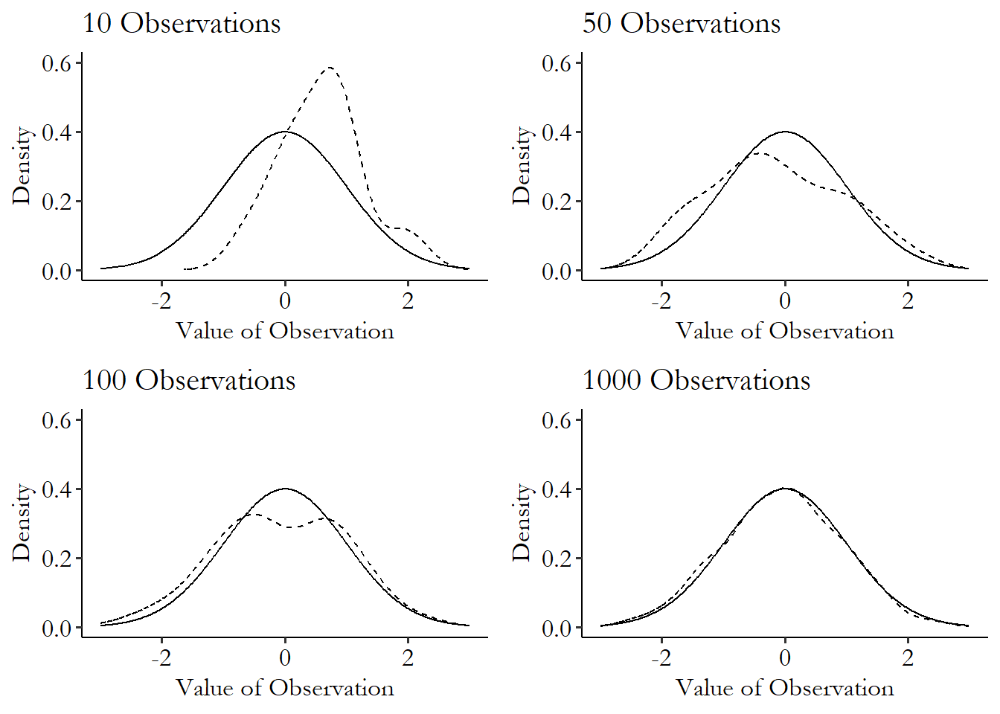

# Describing Variables

**Learning objectives:**

- Review variable types
- Explore observed distributions
- Use summary statistics
- Introduce theoretical distributions

```{r, echo = FALSE, message = FALSE, warning = FALSE}
library("dplyr")
library("ggplot2")
library("gt")
library("infer")
library("janitor")
library("scales")

load("data/school.RData")
load("data/scorecard.RData")
```

```{r}
sessionInfo()
```


## Descriptions of Variables

**Variable**: a bunch of observations of the same measurement

* data set: [College Scorecard](https://collegescorecard.ed.gov/data/)

  * [College Scorecard R package](https://cran.r-project.org/web/packages/collegeScorecard/refman/collegeScorecard.html)

### School {-}

```{r, echo = FALSE}
str(school, give.attr = FALSE)
```

### Scorecard {-}

```{r, echo = FALSE}
str(scorecard, give.attr = FALSE)
```

## Types of Variables

```{r, echo = FALSE}
scorecard |>
  filter(academic_year == "2022-23") |>
  filter(!is.na(cost_avg)) |>
  ggplot(aes(x = cost_avg)) +
  geom_density(color = "orange", linewidth = 2) +
  labs(title = "Continuous Data",
       subtitle = "Density Plot",
       caption = "Source: College Scorecard\n2022 - 2023",
       x = "average cost per year (dollars)",
       y = "") +
  theme_minimal() +
  theme(axis.text.y = element_blank(),
        plot.title = element_text(size = 16),
        plot.subtitle = element_text(size = 14),
        plot.caption = element_text(size = 12))
```

```{r, echo = FALSE}
school |>
  filter(!is.na(locale_type)) |>
  ggplot(aes(x = locale_type, fill = locale_type)) +
  geom_bar(color = "black", stat = "count") +
  labs(title = "Count Data",
       subtitle = "Bar Plot",
       caption = "Source: College Scorecard",
       x = "locale type",
       y = "count") +
  theme_minimal() +
  theme(legend.position = "none",
        plot.title = element_text(size = 16),
        plot.subtitle = element_text(size = 14),
        plot.caption = element_text(size = 12))
```

```{r, echo = FALSE}
school |>
  filter(!is.na(deg_highest)) |>
  ggplot(aes(x = deg_highest, fill = deg_highest)) +
  geom_bar(color = "black", stat = "count") +
  labs(title = "Ordinal Data",
       subtitle = "Bar Plot",
       caption = "Source: College Scorecard",
       x = "highest degree offered",
       y = "count") +
  theme_minimal() +
  theme(legend.position = "none",
        plot.title = element_text(size = 16),
        plot.subtitle = element_text(size = 14),
        plot.caption = element_text(size = 12))
```

```{r, echo = FALSE}
school |>
  filter(!is.na(control)) |>
  ggplot(aes(x = control, fill = control)) +
  geom_bar(color = "black", stat = "count") +
  labs(title = "Categorical Data",
       subtitle = "Bar Plot",
       caption = "Source: College Scorecard",
       x = "college type",
       y = "count") +
  theme_minimal() +
  theme(legend.position = "none",
        plot.title = element_text(size = 16),
        plot.subtitle = element_text(size = 14),
        plot.caption = element_text(size = 12))
```

```{r, echo = FALSE}
school |>
  filter(!is.na(is_hbcu)) |>
  ggplot(aes(x = is_hbcu, fill = is_hbcu)) +
  geom_bar(color = "black", stat = "count") +
  labs(title = "Binary Data",
       subtitle = "Bar Plot",
       caption = "Source: College Scorecard",
       x = "Historically Black Colleges and Universities",
       y = "count") +
  theme_minimal() +
  theme(legend.position = "none",
        plot.title = element_text(size = 16),
        plot.subtitle = element_text(size = 14),
        plot.caption = element_text(size = 12))
```

```{r, echo = FALSE}
set.seed(2026)
school |>
  filter(!is.na(state)) |>
  select(name, city, state) |>
  group_by(state) |>
  sample_n(size = 1) |>
  ungroup() |>
  gt() |>
  #cols_align(align = "center") |>
  tab_footnote(footnote = "Source: College Scorecard") |>
  tab_header(
    title = "Qualitative Data",
    subtitle = "Tabular Data"
  ) |>
  tab_style(
    style = cell_text(weight = "bold"),
    locations = cells_column_labels()
  )
```


## The Distribution

### Categorical Variables

```{r, echo = FALSE}
school |>
  filter(!is.na(deg_highest)) |>
  filter(!is.na(deg_predominant)) |>
  tabyl(deg_highest, deg_predominant) |>
  adorn_totals(c("row", "col")) |>
  adorn_title("combined") |>
  gt() |>
  #cols_align(align = "center") |>
  tab_footnote(footnote = "Source: College Scorecard") |>
  tab_header(
    title = "Categorical Data",
    subtitle = "Tabulated Data"
  )
```


### Histograms

```{r, echo = FALSE}
scorecard_2013 <- scorecard |>
  filter(academic_year == "2012-13") |>
  filter(!is.na(amnt_earnings_med_10y))
```


```{r, echo = FALSE}
scorecard_2013 |>
  filter(amnt_earnings_med_10y <= 150000) |>
  ggplot(aes(x = amnt_earnings_med_10y)) +
  geom_histogram(color = "black", fill = "orange", bins = 4) +
  labs(title = "Continuous Data",
       subtitle = "Histogram (bins: 4)",
       caption = "Source: College Scorecard\n2012 - 2013",
       x = "average salary (dollars) 10 years after college",
       y = "") +
  scale_x_continuous(labels = scales::comma) +
  theme_minimal() +
  theme(axis.text.y = element_blank(),
        plot.title = element_text(size = 16),
        plot.subtitle = element_text(size = 14),
        plot.caption = element_text(size = 12))
```

```{r, echo = FALSE}
scorecard_2013 |>
  filter(amnt_earnings_med_10y <= 150000) |>
  ggplot(aes(x = amnt_earnings_med_10y)) +
  geom_histogram(color = "black", fill = "orange", bins = 8) +
  labs(title = "Continuous Data",
       subtitle = "Histogram (bins: 8)",
       caption = "Source: College Scorecard\n2012 - 2013",
       x = "average salary (dollars) 10 years after college",
       y = "") +
  scale_x_continuous(labels = scales::comma) +
  theme_minimal() +
  theme(axis.text.y = element_blank(),
        plot.title = element_text(size = 16),
        plot.subtitle = element_text(size = 14),
        plot.caption = element_text(size = 12))
```

```{r, echo = FALSE}
scorecard_2013 |>
  filter(amnt_earnings_med_10y <= 150000) |>
  ggplot(aes(x = amnt_earnings_med_10y)) +
  geom_histogram(color = "black", fill = "orange", bins = 16) +
  labs(title = "Continuous Data",
       subtitle = "Histogram (bins: 16)",
       caption = "Source: College Scorecard\n2012 - 2013",
       x = "average salary (dollars) 10 years after college",
       y = "") +
  scale_x_continuous(labels = scales::comma) +
  theme_minimal() +
  theme(axis.text.y = element_blank(),
        plot.title = element_text(size = 16),
        plot.subtitle = element_text(size = 14),
        plot.caption = element_text(size = 12))
```

```{r, echo = FALSE}
scorecard_2013 |>
  filter(amnt_earnings_med_10y <= 150000) |>
  ggplot(aes(x = amnt_earnings_med_10y)) +
  geom_histogram(color = "black", fill = "orange", bins = 32) +
  labs(title = "Continuous Data",
       subtitle = "Histogram (bins: 32)",
       caption = "Source: College Scorecard\n2012 - 2013",
       x = "average salary (dollars) 10 years after college",
       y = "") +
  scale_x_continuous(labels = scales::comma) +
  theme_minimal() +
  theme(axis.text.y = element_blank(),
        plot.title = element_text(size = 16),
        plot.subtitle = element_text(size = 14),
        plot.caption = element_text(size = 12))
```

```{r, echo = FALSE}
scorecard_2013 |>
  filter(amnt_earnings_med_10y <= 150000) |>
  ggplot(aes(x = amnt_earnings_med_10y)) +
  geom_histogram(color = "black", fill = "orange", bins = 64) +
  labs(title = "Continuous Data",
       subtitle = "Histogram (bins: 64)",
       caption = "Source: College Scorecard\n2012 - 2013",
       x = "average salary (dollars) 10 years after college",
       y = "") +
  scale_x_continuous(labels = scales::comma) +
  theme_minimal() +
  theme(axis.text.y = element_blank(),
        plot.title = element_text(size = 16),
        plot.subtitle = element_text(size = 14),
        plot.caption = element_text(size = 12))
```


### Density Plot

```{r, echo = FALSE, warning = FALSE}
scorecard_2013 |>
  filter(amnt_earnings_med_10y <= 150000) |>
  ggplot(aes(x = amnt_earnings_med_10y)) +
  geom_density(color = "black") +
  geom_area(aes(x = stage(amnt_earnings_med_10y,
                          after_stat = oob_censor(x, 
                                                  c(40000, 50000)))),
            stat = "density", fill = "orange") +
  labs(title = "Continuous Data",
       subtitle = "Density Plot",
       caption = "Source: College Scorecard\n2012 - 2013",
       x = "average salary (dollars) 10 years after college",
       y = "") +
  scale_x_continuous(labels = scales::comma) +
  theme_minimal() +
  theme(axis.text.y = element_blank(),
        plot.title = element_text(size = 16),
        plot.subtitle = element_text(size = 14),
        plot.caption = element_text(size = 12))
```

```{r}
mean(scorecard_2013$amnt_earnings_med_10y >= 40000 &
       scorecard_2013$amnt_earnings_med_10y <= 50000)
```


## Summarizing the Distribution

-   Whole distribution is too much information to take in

-   Pick ways to take the entire distribution and produce a few numbers that describe that distribution pretty well.

### Centrality

```{r}
summary(scorecard_2013$amnt_earnings_med_10y)
```
* **mean**: representative *value*
* **median**: representative *observation*


### Percentiles

```{r, echo = FALSE, warning = FALSE}
p25 <- quantile(scorecard_2013$amnt_earnings_med_10y, 0.25)

scorecard_2013 |>
  filter(amnt_earnings_med_10y <= 150000) |>
  ggplot(aes(x = amnt_earnings_med_10y)) +
  geom_density(color = "black") +
  geom_area(aes(x = stage(amnt_earnings_med_10y,
                          after_stat = oob_censor(x, c(0, p25)))),
            stat = "density", fill = "orange") +
  labs(title = "Continuous Data",
       subtitle = "25th percentile",
       caption = "Source: College Scorecard\n2012 - 2013",
       x = "average salary (dollars) 10 years after college",
       y = "") +
  scale_x_continuous(labels = scales::comma) +
  theme_minimal() +
  theme(axis.text.y = element_blank(),
        plot.title = element_text(size = 16),
        plot.subtitle = element_text(size = 14),
        plot.caption = element_text(size = 12))
```

```{r}
quantile(scorecard_2013$amnt_earnings_med_10y, 0.25)
```

```{r, echo = FALSE, warning = FALSE}
p75 <- quantile(scorecard_2013$amnt_earnings_med_10y, 0.75)

scorecard_2013 |>
  filter(amnt_earnings_med_10y <= 150000) |>
  ggplot(aes(x = amnt_earnings_med_10y)) +
  geom_density(color = "black") +
  geom_area(aes(x = stage(amnt_earnings_med_10y,
                          after_stat = oob_censor(x, c(0, p75)))),
            stat = "density", fill = "orange") +
  labs(title = "Continuous Data",
       subtitle = "75th percentile",
       caption = "Source: College Scorecard\n2012 - 2013",
       x = "average salary (dollars) 10 years after college",
       y = "") +
  scale_x_continuous(labels = scales::comma) +
  theme_minimal() +
  theme(axis.text.y = element_blank(),
        plot.title = element_text(size = 16),
        plot.subtitle = element_text(size = 14),
        plot.caption = element_text(size = 12))
```

```{r}
quantile(scorecard_2013$amnt_earnings_med_10y, 0.75)
```


## Variation {-}

```{r, echo = FALSE, warning = FALSE}
scorecard_2013 |>
  left_join(school, by = join_by(id)) |>
  filter(!is.na(deg_predominant)) |>
  filter(amnt_earnings_med_10y <= 150000) |>
  ggplot(aes(x = amnt_earnings_med_10y)) +
  geom_density(aes(fill = deg_predominant), alpha = 0.75, color = "black") +
  labs(title = "Variation",
       subtitle = "Density Plots",
       caption = "Source: College Scorecard\n2012 - 2013",
       x = "average salary (dollars) 10 years after college",
       y = "") +
  scale_x_continuous(labels = scales::comma) +
  theme_minimal() +
  theme(axis.text.y = element_blank(),
        plot.title = element_text(size = 16),
        plot.subtitle = element_text(size = 14),
        plot.caption = element_text(size = 12))
```

* certificate programs: least variance
* graduate programs: most variance


### Standard Deviation {-}

```{r, echo = FALSE, warning = FALSE}
xbar <- mean(scorecard_2013$amnt_earnings_med_10y)
s <- sd(scorecard_2013$amnt_earnings_med_10y)

scorecard_2013 |>
  filter(amnt_earnings_med_10y <= 100000) |>
  ggplot(aes(x = amnt_earnings_med_10y)) +
  geom_density(color = "gray50") +
  geom_area(aes(x = stage(amnt_earnings_med_10y,
                          after_stat = oob_censor(x, c(xbar - s, xbar + s)))),
            stat = "density", fill = "orange") +
  geom_vline(xintercept = xbar, color = "black", linewidth = 2) +
  geom_vline(xintercept = c(xbar - s, xbar + s), 
             color = "black", 
             linetype = 2,
             linewidth = 2) +
  labs(title = "Standard Deviation",
       subtitle = "within one standard deviation",
       caption = "Source: College Scorecard\n2012 - 2013",
       x = "average salary (dollars) 10 years after college",
       y = "") +
  scale_x_continuous(breaks = c(xbar - s, xbar, xbar + s)) +
  theme_minimal() +
  theme(axis.text.y = element_blank(),
        plot.title = element_text(size = 16),
        plot.subtitle = element_text(size = 14),
        plot.caption = element_text(size = 12))
```

### Interquartile Range {-}

```{r, echo = FALSE, warning = FALSE}
p25 <- quantile(scorecard_2013$amnt_earnings_med_10y, 0.25, names = FALSE)
p50 <- quantile(scorecard_2013$amnt_earnings_med_10y, 0.50, names = FALSE)
p75 <- quantile(scorecard_2013$amnt_earnings_med_10y, 0.75, names = FALSE)

scorecard_2013 |>
  filter(amnt_earnings_med_10y <= 100000) |>
  ggplot(aes(x = amnt_earnings_med_10y)) +
  geom_density(color = "gray50") +
  geom_area(aes(x = stage(amnt_earnings_med_10y,
                          after_stat = oob_censor(x, c(p25, p75)))),
            stat = "density", fill = "orange") +
  geom_vline(xintercept = p50, color = "black", linewidth = 2) +
  geom_vline(xintercept = c(p25, p75), 
             color = "black", 
             linetype = 2,
             linewidth = 2) +
  labs(title = "Interquartile Range",
       subtitle = "and the median",
       caption = "Source: College Scorecard\n2012 - 2013",
       x = "average salary (dollars) 10 years after college",
       y = "") +
  scale_x_continuous(breaks = c(p25, p50, p75)) +
  theme_minimal() +
  theme(axis.text.y = element_blank(),
        plot.title = element_text(size = 16),
        plot.subtitle = element_text(size = 14),
        plot.caption = element_text(size = 12))
```

* difference between 75th and 25th percentiles


## Skew {-}

```{r, echo = FALSE, warning = FALSE}
scorecard |>
  filter(!is.na(rate_admissions)) |>
  ggplot(aes(x = rate_admissions)) +
  geom_density(color = "orange", linewidth = 3) +
  labs(title = "Left Skew",
       subtitle = "Density Plot",
       caption = "Source: College Scorecard",
       x = "admissions rate",
       y = "") +
  theme_minimal() +
  theme(axis.text.y = element_blank(),
        plot.title = element_text(size = 16),
        plot.subtitle = element_text(size = 14),
        plot.caption = element_text(size = 12))
```

```{r, echo = FALSE, warning = FALSE}
scorecard |>
  filter(!is.na(cost_tuition_in)) |>
  ggplot(aes(x = cost_tuition_in)) +
  geom_density(color = "orange", linewidth = 3) +
  labs(title = "Right Skew",
       subtitle = "Density Plot",
       caption = "Source: College Scorecard",
       x = "in-state tuition (dollars)",
       y = "") +
  theme_minimal() +
  theme(axis.text.y = element_blank(),
        plot.title = element_text(size = 16),
        plot.subtitle = element_text(size = 14),
        plot.caption = element_text(size = 12))
```

  - describes how the distribution leans to one side or the other
  - opposite: symmetric
  - Handling: **transformation** to shrink impact of huge observations
    -   logarithm (positive inputs) 
    -   asinh (nonnegative inputs)

## Theoretical Distributions

- **Inference**: We have reality, but we want the truth from that

```{r, echo = FALSE}
frameworks <- c("example", "frequentist", "causal")
element <- c(latex("x"), "observation", "observation")
aggregation <- c(latex("\\bar{x}"), "samp stat", "estimate")
truth <- c(latex("\\mu"), "pop stat", "estimand")
modification <- c(latex("\\hat{\\mu}"), "samp dist", "estimator")

terminology_table <- data.frame(frameworks, element, aggregation, truth, modification)

terminology_table |>
  gt() |>
  cols_align(align = "center") |>
  # fmt(fns = list(
  #     latex = function(x) x,          # Pass raw string directly to LaTeX
  #     default = function(x) x         # Fallback for HTML/other contexts
  #   ),
  #   rows = everything()) |>
  # fmt_markdown(columns = everything()) |>
  tab_footnote(footnote = "Source: The Effect and Everyday Causal Inference") |>
  tab_header(
    title = "Theoretical Distributions",
    subtitle = "Useful Terminology"
  ) |>
  tab_style(
    style = cell_text(weight = "bold"),
    locations = cells_column_labels()
  ) |>
  tab_style(
    style = list(cell_fill(color = "#FFB3BA")),
    locations = cells_body(columns = element)
  ) |>
  tab_style(
    style = list(cell_fill(color = "#FFFFBA")),
    locations = cells_body(columns = aggregation)
  ) |>
  tab_style(
    style = list(cell_fill(color = "#BAFFC9")),
    locations = cells_body(columns = truth)
  ) |>
  tab_style(
    style = list(cell_fill(color = "#BAE1FF")),
    locations = cells_body(columns = modification)
  )
```


-   Theoretical distribution generated data.
    -   Don’t care about mean in our data, but about the mean of the true distribution for everyone 
    -   And the bigger our number of observations gets, the gooder-enougher we become.
        

## NHST {-}

### Null Hypothesis Significance Testing {-}

* **Step 1**: Define null and alternative hypotheses

$$\begin{array}{rrcl}
  H_{0}: & \mu & = & 35000 \\
  H_{0}: & \mu & \neq & 35000 \\
\end{array}$$

* **Step 2**: Pick a test statistic with a known distribution.  Here: bootstrap null distribution

```{r, message = FALSE, warning = FALSE}
bootstrap_distribution <- scorecard |>
  specify(response = amnt_earnings_med_10y) |>
  hypothesize(null = "point", mu = 35000) |>
  generate(reps = 1000, type = "bootstrap") |>
  calculate(stat = "mean")
```

* **Step 3**: Get that same test statistic in the data

```{r, message = FALSE, warning = FALSE}
obs_mean <- scorecard |>
  specify(response = amnt_earnings_med_10y) |>
  calculate(stat = "mean")
```

* **Step 4**: How likely to get observed value (or more extreme)?

```{r}
bootstrap_distribution |>
  visualize() +
  shade_p_value(obs_mean, direction = "two_sided")
```

```{r}
bootstrap_distribution |>
  get_p_value(obs_mean, direction = "two_sided")
```

* **Step 5**: Determine whether we can reject the null hypothesis.

  * Since p-value $< 0.05$, we reject the null hypothesis that the average median salary for college cohorts (10 years after graduation) is \$35k (at the $\alpha = 0.05$ level)
  * not a statement of correct or incorrect
  * we reject this particular bootstrap distribution


## Meeting Videos {.unnumbered}

### Cohort 1 {.unnumbered}

`r knitr::include_url("https://www.youtube.com/embed/URL")`

<details>

<summary>Meeting chat log</summary>

```         
LOG
```

</details>
