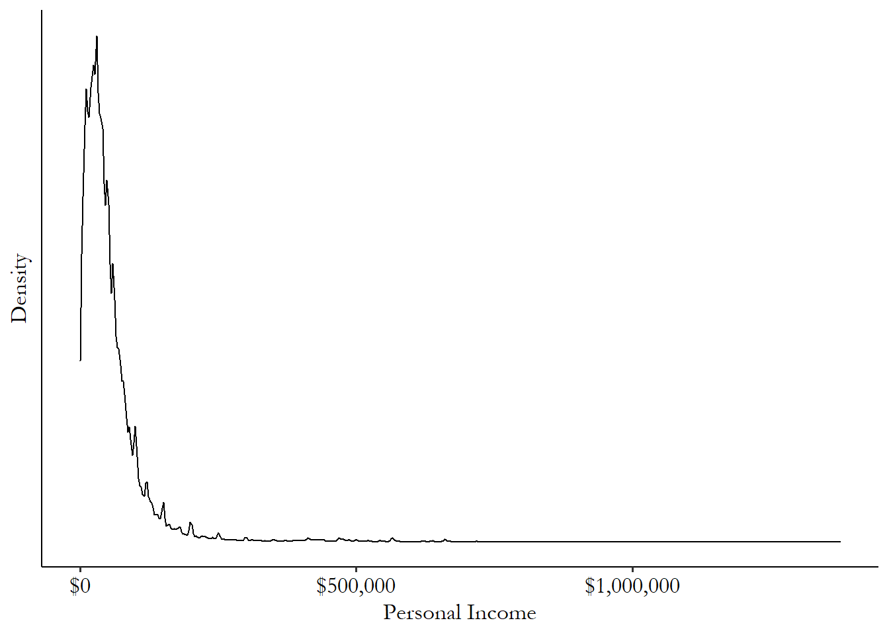

# Describing Variables

**Learning objectives:**

-   Reviewing variable types
-   How are variables distributed, and how can we show that?
-   How do we summarize variables?

## Overview

-   «empirical research questions really come down entirely to describing the density distributions of statistical variables.»
-   A variable, in the context of empirical research, is a bunch of observations of the same measurement
-   Successfully describing a variable means being able to take those observations and clearly explain what was observed without making someone look through all 744 neuroticism scores themselves.

## Variable types

-   Continuous
-   Count (often treated as continuous)
-   Ordinal
-   Categorical – subgroup: binary (categorical can be turned into binary)
-   Qualitative (e.g. text data)

## Distribution

-   A variable’s distribution is a description of how often different values occur.
-   Categorical/ordinal:
    -   **table** with percentages AKA frequency table/bar chart
-   Continuous:
    -   **histogram** (like bar chart): It’s the exact same thing as the frequency table or graph we used for the categorical variable, except that the categories are ranges of the variable rather than the full list of values it could take.
    -   **Density plot**: like drawing infinitely small ranges for a histogram. we can describe the probability of being in a given range of the variable by seeing how large the area underneath the distribution is.
    -   

## Summarizing the distribution

-   Whole distribution is too much information to take in

-   So our goal is to pick ways to take the entire distribution and produce a few numbers that describe that distribution pretty well.

## Mean, Percentiles, IQR

-   Mean: Central tendency: representative value
-   Percentiles: shading in just a bit of the distribution
    -   Median: right in the middle, central tendency (representative observation)
    -   Minimum
    -   Maximum: max – min = range
-   Inter-quartile range (**IQR**): exactly half of the distribution

## Variation 


  -   How wide a distribution is
  -   e.g. Number of children vs. Number of eyes
  -   Measure: variance
  -   Variance is squared, so use standard deviation (same unit)


## Skew



  -   describes how the distribution leans to one side or the other; opposite: symmetric
  -   Handling: transformation to shrink impact of huge observations
    -   e.g. log (no 0s) 
    -   asinh (with 0s, but no negative values)

## Theoretical Distributions

-   We have reality, but we want the truth from that (inference)
-   Notation
    -   English/Latin letters: data
    -   Modifications of English/Latin letters: calculations with real data
    -   Greek letters: truth
    -   Modifications of Greek letters: our estimation of the truth; most commonly: hat So $\hat{\mu}$ is “my estimate of what I think 𝜇 is.”
-   Theoretical distribution generated data.
    -   Don’t care about mean in our data, but about the mean of the true distribution for everyone 
    -   And the bigger our number of observations gets, the gooder-enougher we become.
        
-   Hypothesis testing: we can check if our distribution has a certain mu, by checking out our standard deviation and then running a two-sided t-test.

## Meeting Videos {.unnumbered}

### Cohort 1 {.unnumbered}

`r knitr::include_url("https://www.youtube.com/embed/URL")`

<details>

<summary>Meeting chat log</summary>

```         
LOG
```

</details>
