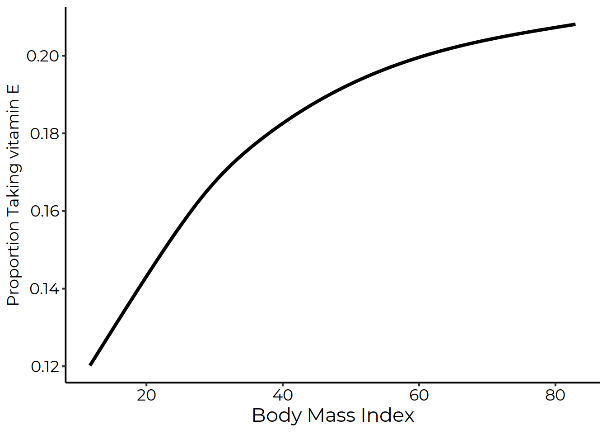
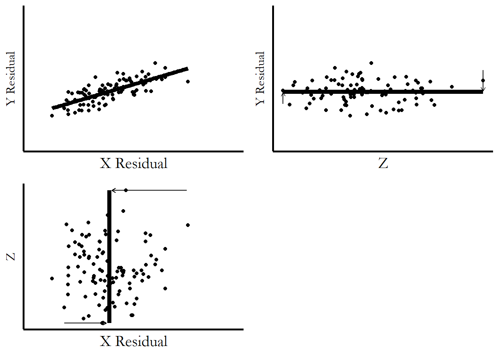

# Describing Relationships

**Learning objectives:**

-   Review: what's a relationship?
-   Conditional distributions and means
-   Why do we use regressions?
-   Controls

## Relationships

The relationship between two variables shows you what learning about one variable tells you about the other.

-   E.g. height/age for children
-   Positive/negative/null/combination

Scatterplot to show relationship

-   Place to start
-   Shows ALL the relationship/information, like density plot

## Conditional distributions

A conditional distribution is the distribution of one variable given the value of another variable.

-   Learning about one variable changes the distribution of the other variable
-   Conditional probability: e.g. probability of being a woman for someone who is called Sarah
-   Conditional distributions: same, but for a distribution

## Conditional means

Since we have the conditional distribution, we can get any conditional feature of that distribution.

-   Work with mean, since handy
-   discrete
-   Alternative: LOESS (locally estimated scatterplot smoothing), non-parametric version



## Line-fitting/regression

> Instead of thinking locally and producing estimates of the mean of 𝑌 conditional on values of 𝑋, we can assume that the underlying relationship between 𝑌 and 𝑋 can be represented by some sort of shape. In basic forms of regression, that shape is a straight line.

-   can describe relationship for missing data
-   clear: positive/negative
-   results are more precise since using all data
-   ☹ line – have to pick shape of line
    -   OLS: use linear/squared/log, but with linear coefficient
    -   no OLS: different function
-   Other option: Pearson correlation coefficient
    -   Nice to interpret: between -1 and 1

## Conditional Conditional Means (not a typo) AKA using controls

> If we really want to know if ice cream-eating affects shorts-wearing, we would want to know how much of a relationship is there between ice cream and shorts that isn’t explained by temperature? So we would get the mean of ice cream conditional on temperature, and then take the residual, getting only the variation in ice cream that has nothing to do with temperature. Then we would take the mean of shorts-wearing conditional on temperature, and take the residual, getting only the variation in shorts-wearing that has nothing to do with temperature. Finally, we get the mean of the shorts-wearing residual conditional on the ice cream residual. If the shorts mean doesn’t change much conditional on different values of ice cream eating, then the entire relationship was just explained by heat! If there’s still a strong relationship there, maybe we do have something.



## Meeting Videos {.unnumbered}

### Cohort 1 {.unnumbered}

`r knitr::include_url("https://www.youtube.com/embed/URL")`

<details>

<summary>Meeting chat log</summary>

```         
LOG
```

</details>
