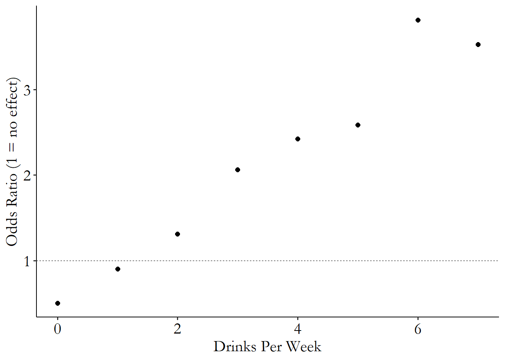

# Identification

**Learning Objectives:**

- Define data generating processes
- Clarify which variation in our data answers our research question
- Explore the identification process

<!--

- What are data generating processes?  
- What variation in our data answers our research question? How do we find it? 
- What is the identification process? 
- Reinforce conceptual understanding of research process through contrived and real-life observational data examples  

-->

```{r, echo = FALSE, message = FALSE, warning = FALSE}
library("dplyr")
library("ggplot2")
library("janitor")
library("readr")
library("tidyr")

avocado_raw <- readr::read_csv("data/avocado.csv") |>
  janitor::clean_names()
```

<details>
<summary>Session Info</summary>
```{r}
sessionInfo()
``` 
</details>

  
## The Data Generating Process

### Introduction {-}  

- **Data generating process** (DGP): set of underlying laws that determine how the data we observe in created

  - science: regular laws that govern the way the universe works
  - physical law: if movement is *determined* by equation, then we *observe* their movement as data
  - social science: if observed data comes from at least somewhat regular laws, there is a DGP

<!--
  
- Basic premise of science: underlying laws that govern how the world works 
- Laws operate regardless of our knowledge about them  
- We can learn about laws, or data generating processes (DGP), through empirical observation  
- Laws that govern social processes generally not well-behaved like physical laws  
  
-->

### Two Parts of DGPs {-} 
  
1. Parts we already know about process through prior assumptions or research  
2. Parts we don't know: what we're attempting to learn about through additional research  
  
## Hair Color Example {-}  

Assume following laws:  
  
- Income is log-normally distributed  
- Brown hair causes a 10% increase to income  
- A college degree produces a 20% income boost  
 
Other assumptions (laws):  
  
- 20% of population have naturally brown hair  
- 30% of population have college degrees  
- 40% of folks with neither natural brown hair nor college degrees will dye hair brown    

<details>
<summary>Hair Color Data Generation</summary>
  
```{r}
set.seed(1337)
N <- 1337
brown_hair <- sample(c(1,0), N, replace = TRUE, prob = c(0.20, 0.80))
college <- sample(c(1,0), N, replace = TRUE, prob = c(0.30, 0.70))
dye_jobs <- brown_hair
for(i in 1:N){
  if(brown_hair[i] == 0){
    if(college[i] == 0){
      if(runif(1) <= 0.40){
        dye_jobs[i] <- 1
      }
    }
  }
}
brown_hair <- dye_jobs
log_income <- 0.1*brown_hair + 0.2*college + rnorm(N, 5, 1.5)
hair_df <- data.frame(brown_hair, college, log_income)
hair_df$brown_hair <- factor(hair_df$brown_hair)
hair_df$college    <- factor(hair_df$college)

college_df <- hair_df |> filter(college == 1)
```

</details>

```{r, echo = FALSE}
hair_df |>
  ggplot(aes(x = log_income, 
             color = brown_hair,
             group = brown_hair)) +
  geom_density(aes(linetype = brown_hair),
               linewidth = 2) +
  labs(title = "Hair Color Example",
       subtitle = "Premise 1: No prior knowledge of laws",
       caption = "Source: The Effect") +
  theme_minimal()
```

```{r}
brown_haired <- hair_df |> filter(brown_hair == 1) |> pull(log_income)
other_haired <- hair_df |> filter(brown_hair == 0) |> pull(log_income)
log_treatment <- mean(brown_haired) - mean(other_haired)
treatment_eff <- exp(log_treatment)
```

So far, we observe that brown-haired people make `r round(treatment_eff, 2)` as much as people with other hair colors.

- but the stated law was "Brown hair causes a 10% increase to income "


<!--
  
- Let's look at data and try to infer the relationship between brown hair and income:  

  
  
- Based on high-level data exploration, it looks like brown hair is associated with 1.6% higher income.

-->

```{r, echo = FALSE}
college_df |>
  ggplot(aes(x = log_income, 
             color = brown_hair,
             group = brown_hair)) +
  geom_density(aes(linetype = brown_hair),
               linewidth = 2) +
  labs(title = "Hair Color Example",
       subtitle = "Premise 2: Knowledge of all laws except brown hair/income relationship",
       caption = "Source: The Effect") +
  theme_minimal()
```

```{r}
brown_haired <- college_df |> filter(brown_hair == 1) |> pull(log_income)
other_haired <- college_df |> filter(brown_hair == 0) |> pull(log_income)
log_treatment <- mean(brown_haired) - mean(other_haired)
treatment_eff <- exp(log_treatment)
```

So far, we observe that brown-haired people make `r round(treatment_eff, 2)` as much as people with other hair colors.

- but the stated law was "Brown hair causes a 10% increase to income "

<!--

**Premise 2: Knowledge of all laws except brown hair/income relationship**    
  
- Underlying relationship is hard to see because of non-college folks with brown hair who don't benefit from college wage boost  
- We know college-students don't dye hair, so relationship between brown hair and income is not distorted by the relationship with dying one's hair  
- Let's limit data exploration of hair color and income, limited to college students:  
  

    
- Now we see 13% higher income among brown-haired vs. other-colored hair among college students. This is close to the 10% governed by the true DGP  
  
-->
  
### Two core ideas {-}  
  
- Variation - How can we find variation we need and focus on it?
- Identification - How can we use DGP to be sure we're teasing out the right variation?  

## Where's Your Variation?
  
```{r, echo = FALSE}

avocado_df <- avocado_raw  |>
  filter(region == "California") |>
  filter(type == "conventional") |>
  select(date, average_price, total_volume) |>
  mutate(volume = total_volume / 1e6) |>
  separate(date, into = c("year", "month", "day"), sep = "-") |>
  group_by(year, month) |>
  mutate(agg_price = mean(average_price),
         agg_volume = mean(volume)) |>
  ungroup() |>
  mutate(date_label = paste0(year, "-", month))
```

```{r, echo = FALSE}
avocado_df |>
  ggplot(aes(x = average_price, y = volume)) +
  geom_point() +
  labs(title = "California Avocado Sales",
       subtitle = "2015 to 2018, conventional (not 'organic')",
       caption = "Source: Haas Avocado Board\nhttps://www.kaggle.com/datasets/neuromusic/avocado-prices",
       x = "Average Price (dollars per avocaodo)",
       y = "Total Sales Volume (millions)") +
  theme_minimal()
```

<details>
<summary>What can we infer from the above relationship? </summary>
**Conclude**  
  
- Negative statistical relationship between avocado prices and quantity sold 
- Nothing else.
  
**Cannot conclude**  
  
- Increase in avocado price caused lower sales  
- How supply and demand interact to influence price
</details>

<details>
<summary>What research questions might we produce from this chart?</summary>
- What is effect of price increase on avocados demanded?  
- How does number of avocados brought to market influence price charged?
- Effect of price on number of avocados brought to market?
- Temporal effect of quantity demanded from prior week on subsequent week
</details>

<details>
<summary>Can we answer our research questions using the chart?</summary>
No  
</details>

<!--

The graph below depicts weekly Avocado sales quantities in California from 1/2015 - 3/2018  
  


-->  


  
### DGP and Isolating Variation {-}  

- How can we find variation in data that answers our question?  
- What is the variation that we want to find? Assume we want to determine effect of price on demand for avocados  
- Need to have some knowledge about DGP to address these questions


### Avocado DGP {-}

- Assume avocado suppliers set plan for weekly avocado prices at beginning of each month  
- Explanations due to suppliers setting prices or quantities only matter between months  
- Using this information, we can isolate variation due to consumers only.

```{r, echo = FALSE}
monthly_df <- avocado_df |>
  select(year, month, agg_price, agg_volume, date_label) |>
  distinct()

monthly_df |>
  ggplot(aes(x = agg_price, y = agg_volume, color = month, group = month)) +
  geom_line(alpha = 0.75, linewidth = 2) +
  geom_label(aes(x = agg_price, y = agg_volume, label = date_label),
             data = monthly_df |> filter(month == "11")) +
  labs(title = "California Monthly Avocado Sales",
       subtitle = "2015 to 2018, conventional (not 'organic')",
       caption = "Source: Haas Avocado Board\nhttps://www.kaggle.com/datasets/neuromusic/avocado-prices",
       x = "Average Price (dollars per avocaodo)",
       y = "Total Sales Volume (millions)") +
  theme_minimal()
```


<!--


-->

  
## Identification
  
**Identification**: finding and isolating part of variation that answers research question  
  
- Research question takes us from theory to hypothesis  
- Identification takes us from hypothesis to data

### Example of Family Dog, Rex, Escaping House {-}  


- Rex escapes house each night while owners sleep    
  
- One of the owners, Annie, believes dog is escaping through basement window
  
- The owners close-off possible causes of escape in sequential evenings:  
  + doggie door  
  + back door, doggie door
  + blinds, back door, doggie door  
  + air vent, blinds, back door, doggie door
  + Additional cumulative steps taken (e.g., closing off chimney)  
  
- Rex still escapes each night after owners address potential causes  
  
- Only remaining escape hatch is basement window 

  
### Identification Process {-}  

#### Identification in Dog Example {-}  
- Hypothesis: Rex escapes through basement window
- Testing hypothesis involves removing alternative explanations, and isolating the basement window as the single cause of escape.  

## Identification in Practice {-}  
  
- Use statistical procedures to remove unwanted sources of variation  
- Still need theory and assumptions about DGP

Steps to answer research question:  
  
1. Use theory to describe DGP  
2. Use DGP to to find reasons why data appear a certain way that doesn't address research question   
3. Block alternate reasons to isolate variation of interest  
  

## Alcohol and Mortality
  
### Overview {-}  
  
Well-regarded study A.M. Wood et al.(2018) studied effects of alcohol on all-causes mortality  

- more than 200 authors  
- 600k people observed  
- Published in medical journal, The Lancet  
- Study used to set drinking guidelines  
  
### Study Findings {-}  


  
- No benefit to even small amounts of alcohol consumption 
- Risks increase at about 1 drink per day
  
### Book Exercises {-}    
  
- List five things that would be a cause for or related to someone drinking  
- List five things that would cause someone to die  
- Any overlap between the lists?  
  
### Example Answers {-}  
  
- Causes of drinking - risk seeking behavior, which may cause other behaviors like smoking  
- Causes of mortality - numerous indicators of bad-health are acceptable, smoking, risk-taking, dangerous job - Both lists: smoking
  
### Issues with Causal Explanation {-}  
  
- Items on both lists can be classified as an alternate explanation for results  
- What about non-drinkers?  
  + May have higher mortality due to being sick
  + May have high proportion of recovering alcoholics  
    
### Controls in Study to Address Alternate Explanations {-}    
  
- Limited to drinkers only  
- Statistical adjustments: smoking status, age, gender, health indicators like BMI and diabetes  
 
### Lingering Issues {-}  
  
- Risk-seeking behavior in general not controlled for. Smoking is just one example.  
- Removed all non-drinkers, not just sick and recovering alcoholics  
- What if already sick people still drink, but just less than average drinkers? 
- Using methodology in paper, [Chris Auld](https://twitter.com/Chris_Auld/status/1035230771957485568) read the study, and then took the same methods as in the original paper and used them to “prove” that drinking more causes)used data to "prove" drinking causes you to become a man  
  


  
## Context and Omniscience
  
> Here the challenges are not primarily technical in the sense of requiring new theorems or estimators. Rather, progress comes from detailed institutional knowledge and the careful investigation and quantification of the forces at work in a particular setting. Of course, such endeavors are not really new. They have always been at the heart of good empirical research - Joshua Angrist and Alan Krueger (2001).
   
- Context and domain expertise are extremely important  
- Need to understand where data came from
  
Fill in as much of the DGP during design phase of research:  
  
- Read books and articles
- Talk to experts  
- Make sure you get the details right
  
Need for context reveals limitations of observational research:  
  
- Can only really answer questions where context is well understood
- For less understood problems, results should be considered exploratory  
  
Final tips:  
  
- Try to address hugely important parts of DGP  
- Acknowledge assumptions   
- Try to spot gaps in knowledge in DGP, make realistic guesses about what's in the gap
- Don't aim for perfection  
  

## Meeting Videos {-}

### Cohort 1 {-}

`r knitr::include_url("https://www.youtube.com/embed/2XITeWLTZZQ")`

<details>
<summary> Meeting chat log </summary>

```
00:03:25    John Ellis:    start
00:07:35    John Ellis:    Adding here for visibility: We have volunteers for next week Chapter 6 (Aaron) and 8/14 for Chapter 7 (John), but please look ahead and sign up as you can, ideally we have at least the next 3 weeks planned out. Its a great learning experience as well as helps allow you to consider facilitating in other book clubs
00:18:24    Federica Gazzelloni:    It's more a density distribution
00:23:46    Federica Gazzelloni:    One is the dependent variable and the other the independent.
00:26:30    Federica Gazzelloni:    Interesting to see the influence of time in prices
00:27:30    Sarah Zeller:    hey Aaron, we can't hear you anymore
00:27:49    Sarah Zeller:    still nothing
00:28:16    John Ellis:    You can't hear us either it seems
01:03:34    Sarah Zeller:    stop
```
</details>
