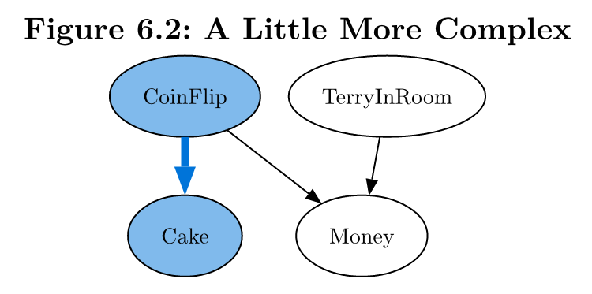
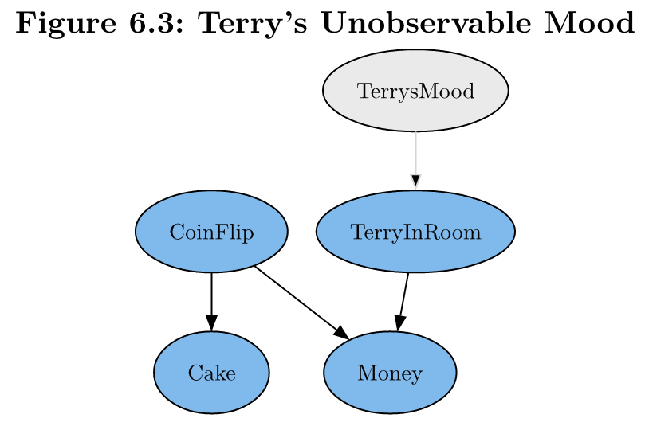
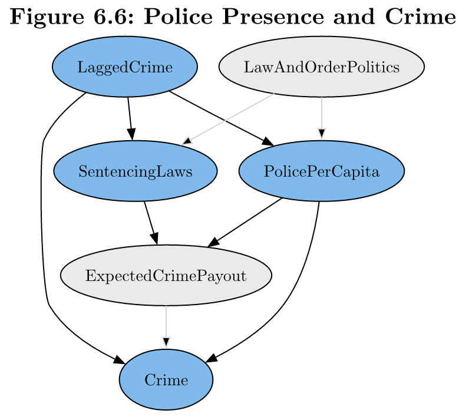

# Causal Diagrams

**Learning objectives:**

- Define causality
- Motivate causal diagramming

<details>
<summary>Session Info</summary>

```{r}
sessionInfo()
```

</details>

## Causality 

- Descriptions

  - "correlated", "are related", "tend to occur together"
  - Better: $X$ is linked to $Y$, $X$ has ramifications for $Y$
  - Even better: $X$ causes $Y$, $X$ improves $Y$, etc.
  - Causality has *direction*
  
<details>
<summary>Draft definition</summary>

We say that $X$ **causes** $Y$ if, were we to intervene and *change* the value of $X$, then the distribution of $Y$ would *also* change as a result.

- But still allows 

  - change in $Y$ without change in $X$
  - far off variables

</details>

<details>
<summary>Revised definition</summary>

We say that $X$ **causes** $Y$ if, were we to intervene and *change* the value of $X$, then 

- The distribution of $Y$ would *also* change as a result

  - even if changing $X$ doesn't always change $Y$
  - changes the *probability* that $Y$ occurs

</details>

- If $X$ causes $Y$, then $X$ must be a part of the DGP (data generating process) that generates our observations of $Y$.


## Causal Diagrams

<details>
<summary>History</summary>

- Developed by Judea Pearl (1990s)
- Wanted artificial intelligence to understand causality

</details>

A **causal diagram** is a representation of a DGP including

1. the variables in the DGP (each represented as a node)
2. the *causal relationships* in the DGP (each represented by an *arrow* from the cause variable to the caused variable)


## Coin-Cake Example {-}

$$\text{CoinFlip} \rightarrow \text{Cake}$$

- Each variable can take multiple values (e.g. "heads" or "tails")
- Arrow doesn't indicate if effect is positive or negative
- "Focus on the important stuff"



- 4 relevant variables (nodes)
- `CoinFlip` causes `Cake` and `Money`
- `Money` doesn't cause anything

<details>
<summary>Typst Code</summary>

```
#import "@preview/autograph:0.1.0": diagram, node, edge

#set page("us-letter") //thanks Europeans!
#set text(
  font: "New Computer Modern",
  size: 14pt
)

#set align(center)
= Figure 6.2: A Little More Complex
#diagram(bezier: true,
  node(<Cake>, fill: blue.lighten(50%)),
  node(<CoinFlip>, fill: blue.lighten(50%)),
  node(<Money>),
  node(<TerryInRoom>),

  edge(<CoinFlip>, <Cake>, stroke: 5pt + blue),
  edge(<CoinFlip>, <Money>),
  edge(<TerryInRoom>, <Money>)
)
```

</details>

## Unobserved Variables {-}

*All* non-trivial variables relevant to the DGP should be included---even if we cannot measure them.

*Unobserved variable*

- Relevant to the DGP
- Researcher doesn't have access



<details>
<summary>Typst Code</summary>

```
= Figure 6.3: Terry's Unobservable Mood
#diagram(bezier: true,
  node(<Cake>, fill: blue.lighten(50%)),
  node(<CoinFlip>, fill: blue.lighten(50%)),
  node(<Money>, fill: blue.lighten(50%)),
  node(<TerryInRoom>, fill: blue.lighten(50%)),
  node(<TerrysMood>, fill: gray.lighten(75%)),

  edge(<CoinFlip>, <Cake>),
  edge(<CoinFlip>, <Money>),
  edge(<TerryInRoom>, <Money>),
  edge(<TerrysMood>, <TerryInRoom>, 
    //fill: gray.lighten(50%),
    stroke: gray.lighten(50%))
)
```

</details>


## The Real World

**Identifying Assumption**: An assumption you make about your causal diagram or data that, if incorrect, means that your approach to identifying the answer to your research question doesn't work.



<details>
<summary>Some Assumptions</summary>

- `LaggedCrime` doesn’t cause `LawAndOrderPolitics`
- `PovertyRate` isn’t a part of the DGP
- `LaggedPolicePerCapita` doesn’t cause `PolicePerCapita` (or anything else for that matter)
- `RecentPopularCrimeMovie` doesn’t cause `Crime`

</details>

<details>
<summary>Typst Code</summary>

```
= Figure 6.6: Police Presence and Crime
#diagram(bezier: true,
  node(<Crime>, fill: blue.lighten(50%)),
  node(<ExpectedCrimePayout>, fill: gray.lighten(75%)),
  node(<LaggedCrime>, fill: blue.lighten(50%)),
  node(<LawAndOrderPolitics>, fill: gray.lighten(75%)),
  node(<PolicePerCapita>, fill: blue.lighten(50%)),
  node(<SentencingLaws>, fill: blue.lighten(50%)),
  
  edge(<ExpectedCrimePayout>, <Crime>, stroke: gray.lighten(50%)),
  edge(<LaggedCrime>, <Crime>),
  edge(<LaggedCrime>, <PolicePerCapita>),
  edge(<LaggedCrime>, <SentencingLaws>),
  edge(<LawAndOrderPolitics>, <PolicePerCapita>, stroke: gray.lighten(50%)),
  edge(<LawAndOrderPolitics>, <SentencingLaws>, stroke: gray.lighten(50%)),
  edge(<PolicePerCapita>, <ExpectedCrimePayout>),
  edge(<PolicePerCapita>, <Crime>),
  edge(<SentencingLaws>, <ExpectedCrimePayout>),
)
```

</details>


## Research Questions


<details>
<summary>Direct Effect</summary>

$X$ has a **direct effect** on $Y$ if $X \rightarrow Y$ is on the graph.

In this example,

$$\text{LaggedCrime} \rightarrow \text{PolicePerCapita}$$

`LaggedCrime` has a direct effect on `PolicePerCapita`.

</details>

<details>
<summary>Indirect Effect</summary>

$X$ has an **indirect effect** on $Y$ if $X \rightarrow Z \rightarrow Y$ is on the graph for some $Z$.

In this example,

$$\text{SentencingLaws} \rightarrow \text{ExpectedCrimePayout} \rightarrow \text{Crime}$$

`SentencingLaws` has an indirect effect on `Crime`.

</details>


## Moderators

The effect of $X$ on $Y$ is **moderated** by $Z$ if the effect is different depending on the value of $Z$.

$$X \rightarrow Y \leftarrow Z$$

A causal diagram may be consistent with many different DGPs

$$Y = 0.2X + 0.3Z$$

* multiple linear regression

$$Y = 1.5X + 5Z + 3XZ$$

* linear regression with an interaction term

$$Y = 2X + 3XZ$$

* $Z$ has no direct effect on $Y$, but does moderate the effect of $X$.


## Meeting Videos {-}

### Cohort 1 {-}

`r knitr::include_url("https://www.youtube.com/embed/URL")`

<details>
<summary> Meeting chat log </summary>

```
LOG
```
</details>
