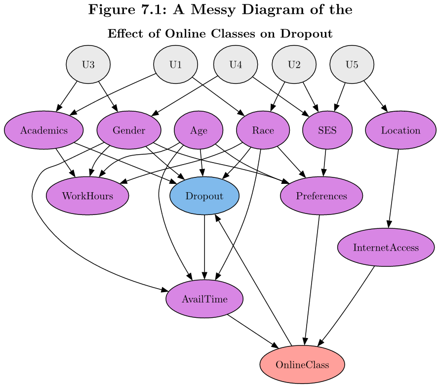
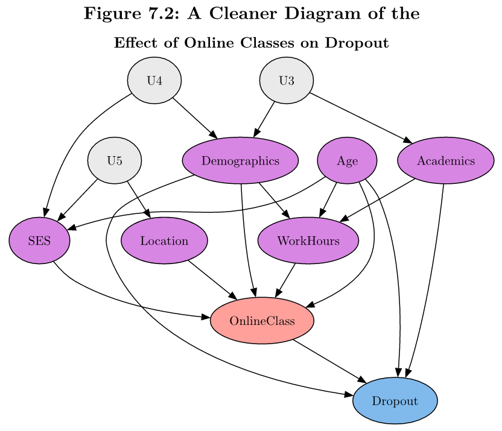
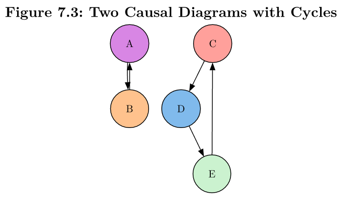

# Drawing Causal Diagrams

**Learning objectives:**

- Build and refine an extensive causal diagram
- Discuss assumptions and choices

## Our Idea of the World

**Causal diagrams** represent the data generating process (DGP) that got us our data.

- Research

$$\text{learned} + \text{intuition}$$


## Thinking through the DGP

Case study: "we were interested in the effect of *taking online courses on staying in college*"

- **Treatment variable**: `OnlineClass`
- **Outcome variable**: `Dropout`
- Then include all variables relevant to DGP


## First Draft DAG {-}



<details>
<summary>Typst Code</summary>

```
= Figure 7.1: A Messy Diagram of the
== Effect of Online Classes on Dropout
#diagram(bezier: true,
  node(<Academics>, fill: purple.lighten(50%)),
  node(<Age>, fill: purple.lighten(50%)),
  node(<AvailTime>, fill: purple.lighten(50%)),
  node(<Dropout>, fill: blue.lighten(50%)),
  node(<Gender>, fill: purple.lighten(50%)),
  node(<InternetAccess>, fill: purple.lighten(50%)),
  node(<Location>, fill: purple.lighten(50%)),
  node(<OnlineClass>, fill: red.lighten(50%)),
  node(<Preferences>, fill: purple.lighten(50%)),
  node(<Race>, fill: purple.lighten(50%)),
  node(<SES>, fill: purple.lighten(50%)),
  node(<WorkHours>, fill: purple.lighten(50%)),
  node(<U1>, fill: gray.lighten(75%)),
  node(<U2>, fill: gray.lighten(75%)),
  node(<U3>, fill: gray.lighten(75%)),
  node(<U4>, fill: gray.lighten(75%)),
  node(<U5>, fill: gray.lighten(75%)),

  edge(<Academics>, <Dropout>),
  edge(<Academics>, <WorkHours>),
  edge(<Age>, <AvailTime>),
  edge(<Age>, <Dropout>),
  edge(<Age>, <Preferences>),
  edge(<Age>, <WorkHours>),
  edge(<AvailTime>, <OnlineClass>),
  edge(<Dropout>, <AvailTime>),
  edge(<Gender>, <AvailTime>),
  edge(<Gender>, <Dropout>),
  edge(<Gender>, <Preferences>),
  edge(<Gender>, <WorkHours>),
  edge(<InternetAccess>, <OnlineClass>), 
  edge(<Location>, <InternetAccess>),
  edge(<OnlineClass>, <Dropout>),
  edge(<Preferences>, <OnlineClass>),
  edge(<Race>, <AvailTime>),
  edge(<Race>, <Dropout>),
  edge(<Race>, <Preferences>),
  edge(<Race>, <WorkHours>),
  edge(<SES>, <Preferences>),
  edge(<U1>, <Academics>),
  edge(<U1>, <Race>),
  edge(<U2>, <Race>),
  edge(<U2>, <SES>),
  edge(<U3>, <Academics>),
  edge(<U3>, <Gender>),
  edge(<U4>, <Gender>),
  edge(<U4>, <SES>),
  edge(<U5>, <Location>),
  edge(<U5>, <SES>),
)
```

</details>


## Simplify

- Too complex: describes everything
- Too simple: does not represent DGP
- Simplify

  - Trivial (e.g. `CoffeeShop`)
  - Redundancy (e.g. `Gender` and `Race` in the DAG)
  - Mediators: if variable exists only as a way for one variable to affect another (e.g. `Preferences`)
  - Irrelevance: if variable isn't on any path between treatment and outcome


## Revised DAG {-}



<details>
<summary>Typst Code</summary>

```
= Figure 7.2: A Cleaner Diagram of the
== Effect of Online Classes on Dropout
#diagram(bezier: true,
  node(<Academics>, fill: purple.lighten(50%)),
  node(<Age>, fill: purple.lighten(50%)),
  node(<Demographics>, fill: purple.lighten(50%)),
  node(<Dropout>, fill: blue.lighten(50%)),
  node(<Location>, fill: purple.lighten(50%)),
  node(<OnlineClass>, fill: red.lighten(50%)),
  node(<SES>, fill: purple.lighten(50%)),
  node(<WorkHours>, fill: purple.lighten(50%)),
  node(<U3>, fill: gray.lighten(75%)),
  node(<U4>, fill: gray.lighten(75%)),
  node(<U5>, fill: gray.lighten(75%)),

  edge(<Academics>, <Dropout>),
  edge(<Academics>, <WorkHours>),
  edge(<Age>, <Dropout>),
  edge(<Age>, <OnlineClass>),
  edge(<Age>, <SES>),
  edge(<Age>, <WorkHours>),
  edge(<Demographics>, <Dropout>),
  edge(<Demographics>, <OnlineClass>),
  edge(<Demographics>, <WorkHours>),
  edge(<Location>, <OnlineClass>),
  edge(<OnlineClass>, <Dropout>),
  edge(<SES>, <OnlineClass>),
  edge(<U3>, <Academics>),
  edge(<U3>, <Demographics>),
  edge(<U4>, <Demographics>),
  edge(<U4>, <SES>),
  edge(<U5>, <Location>),
  edge(<U5>, <SES>),
  edge(<WorkHours>, <OnlineClass>),
)
```

</details>


## Avoiding Cycles



- Lag variables
- Start with randomness

<details>
<summary>Typst Code</summary>

```
= Figure 7.3: Two Causal Diagrams with Cycles

#diagram(bezier: true,
  node(<A>, fill: purple.lighten(50%)),
  node(<B>, fill: orange.lighten(50%)),
  node(<C>, fill: red.lighten(50%)),
  node(<D>, fill: blue.lighten(50%)),
  node(<E>, fill: green.lighten(75%)),

  edge(<A>, <B>),
  edge(<B>, <A>),

  edge(<C>, <D>),
  edge(<D>, <E>),
  edge(<E>, <C>),
)
```

</details>


## Assumptions

- Think about whether our assumptions are reasonable
- Try to base them as much on well-established knowledge and prior research

> If we think there’s reason to be skeptical of them, ask what evidence would support the assumption and try to provide that evidence


## Meeting Videos {-}

### Cohort 1 {-}

`r knitr::include_url("https://www.youtube.com/embed/URL")`

<details>
<summary> Meeting chat log </summary>

```
LOG
```
</details>
