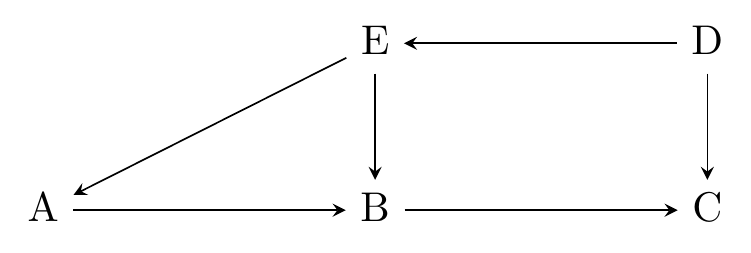
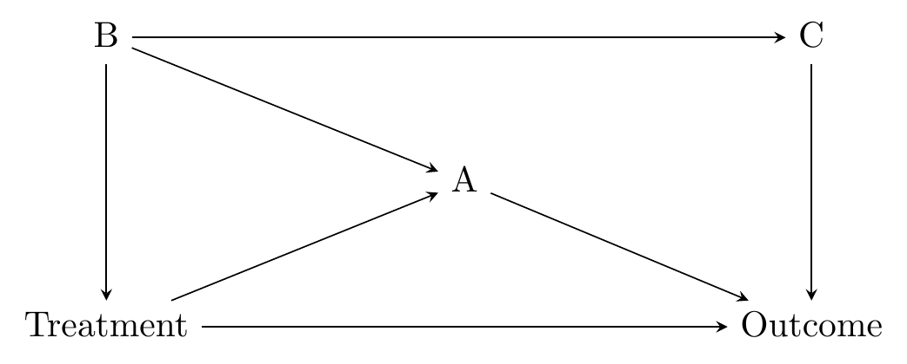
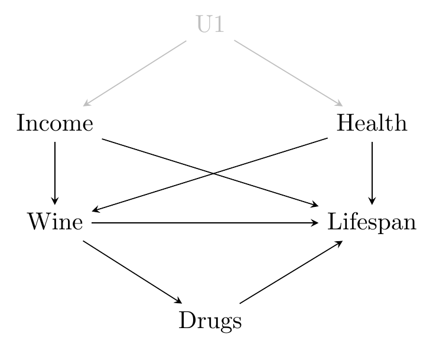

# Causal Paths and Closing Back Doors

**Learning objectives:**

-   identify paths in DAGs
-   understand the difference between good and bad paths, and front-door vs. back-door paths
-   understand how to Close paths
-   find colliders
-   understand how to use paths to test your DAG

## Paths

> A path between two variables on a causal diagram is a description of the set of arrows and nodes you visit when “walking” from one variable to another.

-   tell us how two variables are related
-   how are B and C related?



> The paths can tell us the road we want to walk on, and also the road we want to avoid.

## Finding all paths

1.  Start at the treatment variable
2.  Follow one of the arrows coming in/out of the treatment variable to find another variable
3.  Follow one of the arrows coming in or out of *that* variable
4.  Keep repeating step 3 until you either come to a variable you’ve already visited (loop!), or find the outcome variable (path)
5.  Every time you find a path/loop, back up one and try a different arrow in/out until you’ve tried them all. Then, back up again and try all those arrows

Let's practice!



## Solution


## Let's try another one: Wine and Health




## Solution


## Path types

-   good vs. bad
-   front door vs. back door
-   beware direct vs. indirect effects

> Good Paths are the reasons why the treatment and outcome variables are related that you think should “count” for your research question. Bad paths are the paths that shouldn’t count, in other words the alternate explanations.

> Paths where all the arrows face away from Treatment are also known as front door paths. The rest would then be “back door paths.”

## Closing paths

> A path is Open if all of the variables along that paths are allowed to vary.

So we close a patch by

-   picking a specific data set (e.g., no drug users)
-   adding a variable on the path as control variable
-   matching

So if we want to get the effect of *Wine* on *Lifespan*, which variables do we have to control for?


## Colliders

> A variable is a collider on a particular path if, on that path, both arrows point at it.

-   A path is closed by default if a collider sits on it
-   The path opens up if the collider is controlled for

> Because once you control for the collider, the two variables pointing to the collider become related.

We can avoid colliders by

-   not controlling for them
-   not choosing a sample where the collider is automatically controlled for

## Using paths to test the DAG

1.    List all of the paths between A and B. 
1.    Consider only the open paths.
1.    Do what you need to do to make sure they’re all Closed.
1.    If A and B are still related to each other (placebo test), that means there must be some other path you didn’t account for.

Interpretation of placebo tests:

-   We have a model, so not accounting for all effects is okay.
-   small but nonzero relationship: fine
-   enormous and super-strong relationship: 😱

## Meeting Videos {.unnumbered}

### Cohort 1 {.unnumbered}

`r knitr::include_url("https://www.youtube.com/embed/URL")`

<details>

<summary>Meeting chat log</summary>

```         
LOG
```

</details>
