# Causal Paths and Closing Back Doors

**Learning objectives:**

-   Identify paths in DAGs
-   Classify paths in DAGs
-   Start to close paths
-   Explore colliders
-   Motivate placebo tests

<details>
<summary>Session Info</summary>

```{r}
sessionInfo()
```

</details>


## I Walk the Line

> A path between two variables on a causal diagram is a description of the set of arrows and nodes you visit when “walking” from one variable to another.

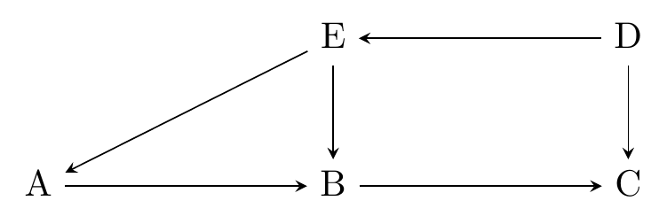

> The paths can tell us the road we want to walk on, and also the road we want to avoid.

## Any Way You Like It

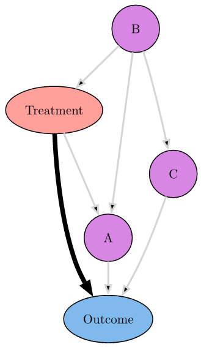

<details>
<summary>Finding all paths</summary>
1.  Start at the treatment variable
2.  Follow one of the arrows coming in/out of the treatment variable to find another variable
3.  Follow one of the arrows coming in or out of *that* variable
4.  Keep repeating step 3 until you either come to a variable you’ve already visited (loop!), or find the outcome variable (path)
5.  Every time you find a path/loop, back up one and try a different arrow in/out until you’ve tried them all. Then, back up again and try all those arrows
</details>

<details>
<summary>Solution</summary>

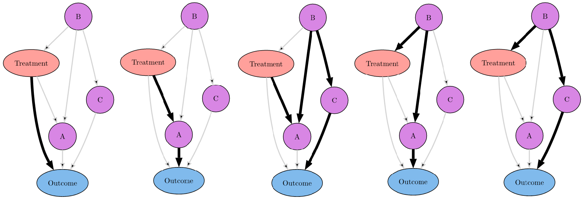

</details>

<details>
<summary>Typst Code</summary>

```
#import "@preview/autograph:0.1.0": diagram, node, edge

#set page(width: 10in, height: 7.5in)
#set text(
  font: "New Computer Modern",
  size: 14pt
)

#set align(center)
= Figure 8.1: Starter Example
#diagram(bezier: true,
  node(<Treatment>, fill: red.lighten(50%)),
  node(<Outcome>, fill: blue.lighten(50%)),
  node(<A>, fill: purple.lighten(50%)),
  node(<B>, fill: purple.lighten(50%)),
  node(<C>, fill: purple.lighten(50%)),

  edge(<Treatment>, <Outcome>, stroke: 5pt, ),
  edge(<Treatment>, <A>, stroke: 2pt + gray.lighten(50%)),
  edge(<A>, <Outcome>, stroke: 2pt + gray.lighten(50%)),
  edge(<B>, <A>, stroke: 2pt + gray.lighten(50%)),
  edge(<B>, <C>, stroke: 2pt + gray.lighten(50%)),
  edge(<B>, <Treatment>, stroke: 2pt + gray.lighten(50%)),
  edge(<C>, <Outcome>, stroke: 2pt + gray.lighten(50%)),
)

#diagram(bezier: true,
  node(<Treatment>, fill: red.lighten(50%)),
  node(<Outcome>, fill: blue.lighten(50%)),
  node(<A>, fill: purple.lighten(50%)),
  node(<B>, fill: purple.lighten(50%)),
  node(<C>, fill: purple.lighten(50%)),

  edge(<Treatment>, <Outcome>, stroke: 2pt + gray.lighten(50%)),
  edge(<Treatment>, <A>, stroke: 5pt, ),
  edge(<A>, <Outcome>, stroke: 5pt, ),
  edge(<B>, <A>, stroke: 2pt + gray.lighten(50%)),
  edge(<B>, <C>, stroke: 2pt + gray.lighten(50%)),
  edge(<B>, <Treatment>, stroke: 2pt + gray.lighten(50%)),
  edge(<C>, <Outcome>, stroke: 2pt + gray.lighten(50%)),
)

#diagram(bezier: true,
  node(<Treatment>, fill: red.lighten(50%)),
  node(<Outcome>, fill: blue.lighten(50%)),
  node(<A>, fill: purple.lighten(50%)),
  node(<B>, fill: purple.lighten(50%)),
  node(<C>, fill: purple.lighten(50%)),

  edge(<Treatment>, <Outcome>, stroke: 2pt + gray.lighten(50%)),
  edge(<Treatment>, <A>, stroke: 5pt, ),
  edge(<A>, <Outcome>, stroke: 2pt + gray.lighten(50%)),
  edge(<B>, <A>, stroke: 5pt, ),
  edge(<B>, <C>, stroke: 5pt, ),
  edge(<B>, <Treatment>, stroke: 2pt + gray.lighten(50%)),
  edge(<C>, <Outcome>, stroke: 5pt, ),
)

#diagram(bezier: true,
  node(<Treatment>, fill: red.lighten(50%)),
  node(<Outcome>, fill: blue.lighten(50%)),
  node(<A>, fill: purple.lighten(50%)),
  node(<B>, fill: purple.lighten(50%)),
  node(<C>, fill: purple.lighten(50%)),

  edge(<Treatment>, <Outcome>, stroke: 2pt + gray.lighten(50%)),
  edge(<Treatment>, <A>, stroke: 2pt + gray.lighten(50%)),
  edge(<A>, <Outcome>, stroke: 5pt, ),
  edge(<B>, <A>, stroke: 5pt, ),
  edge(<B>, <C>, stroke: 2pt + gray.lighten(50%)),
  edge(<B>, <Treatment>, stroke: 5pt, ),
  edge(<C>, <Outcome>, stroke: 2pt + gray.lighten(50%)),
)

#diagram(bezier: true,
  node(<Treatment>, fill: red.lighten(50%)),
  node(<Outcome>, fill: blue.lighten(50%)),
  node(<A>, fill: purple.lighten(50%)),
  node(<B>, fill: purple.lighten(50%)),
  node(<C>, fill: purple.lighten(50%)),

  edge(<Treatment>, <Outcome>, stroke: 2pt + gray.lighten(50%)),
  edge(<Treatment>, <A>, stroke: 2pt + gray.lighten(50%)),
  edge(<A>, <Outcome>, stroke: 2pt + gray.lighten(50%)),
  edge(<B>, <A>, stroke: 2pt + gray.lighten(50%)),
  edge(<B>, <C>, stroke: 5pt, ),
  edge(<B>, <Treatment>, stroke: 5pt, ),
  edge(<C>, <Outcome>, stroke: 5pt, ),
)
```

</details>


## Wine and Lifespan Example {-}

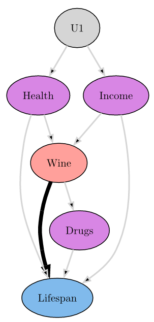


<details>
<summary>Solution</summary>

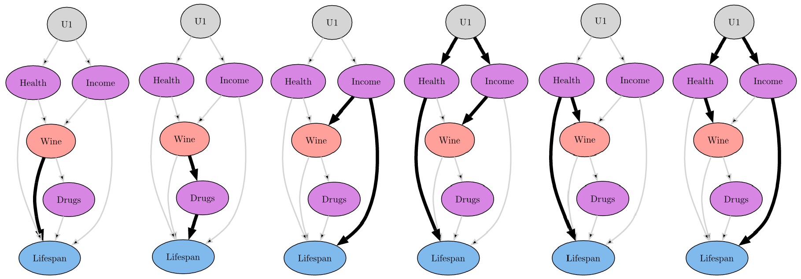

</details>

<details>
<summary>Typst Code</summary>

```
= Figure 8.3: Wine-Lifespan Example
#diagram(bezier: true,
  node(<Wine>, fill: red.lighten(50%)),
  node(<Lifespan>, fill: blue.lighten(50%)),
  node(<Drugs>, fill: purple.lighten(50%)),
  node(<Health>, fill: purple.lighten(50%)),
  node(<Income>, fill: purple.lighten(50%)),
  node(<U1>, fill: gray.lighten(50%)),
  edge(<Wine>, <Lifespan>, stroke: 5pt),
  
  edge(<Drugs>, <Lifespan>, stroke: 2pt + gray.lighten(50%)),
  edge(<Health>, <Lifespan>, stroke: 2pt + gray.lighten(50%)),
  edge(<Health>, <Wine>, stroke: 2pt + gray.lighten(50%)),
  edge(<Income>, <Lifespan>, stroke: 2pt + gray.lighten(50%)),
  edge(<Income>, <Wine>, stroke: 2pt + gray.lighten(50%)),
  edge(<U1>, <Health>, stroke: 2pt + gray.lighten(50%)),
  edge(<U1>, <Income>, stroke: 2pt + gray.lighten(50%)),
  edge(<Wine>, <Drugs>, stroke: 2pt + gray.lighten(50%)),
)

#diagram(bezier: true,
  node(<Wine>, fill: red.lighten(50%)),
  node(<Lifespan>, fill: blue.lighten(50%)),
  node(<Drugs>, fill: purple.lighten(50%)),
  node(<Health>, fill: purple.lighten(50%)),
  node(<Income>, fill: purple.lighten(50%)),
  node(<U1>, fill: gray.lighten(50%)),
  edge(<Wine>, <Lifespan>, stroke: 2pt + gray.lighten(50%)),
  
  edge(<Drugs>, <Lifespan>, stroke: 5pt),
  edge(<Health>, <Lifespan>, stroke: 2pt + gray.lighten(50%)),
  edge(<Health>, <Wine>, stroke: 2pt + gray.lighten(50%)),
  edge(<Income>, <Lifespan>, stroke: 2pt + gray.lighten(50%)),
  edge(<Income>, <Wine>, stroke: 2pt + gray.lighten(50%)),
  edge(<U1>, <Health>, stroke: 2pt + gray.lighten(50%)),
  edge(<U1>, <Income>, stroke: 2pt + gray.lighten(50%)),
  edge(<Wine>, <Drugs>, stroke: 5pt),
)

#diagram(bezier: true,
  node(<Wine>, fill: red.lighten(50%)),
  node(<Lifespan>, fill: blue.lighten(50%)),
  node(<Drugs>, fill: purple.lighten(50%)),
  node(<Health>, fill: purple.lighten(50%)),
  node(<Income>, fill: purple.lighten(50%)),
  node(<U1>, fill: gray.lighten(50%)),
  edge(<Wine>, <Lifespan>, stroke: 2pt + gray.lighten(50%)),
  
  edge(<Drugs>, <Lifespan>, stroke: 2pt + gray.lighten(50%)),
  edge(<Health>, <Lifespan>, stroke: 2pt + gray.lighten(50%)),
  edge(<Health>, <Wine>, stroke: 2pt + gray.lighten(50%)),
  edge(<Income>, <Lifespan>, stroke: 5pt),
  edge(<Income>, <Wine>, stroke: 5pt),
  edge(<U1>, <Health>, stroke: 2pt + gray.lighten(50%)),
  edge(<U1>, <Income>, stroke: 2pt + gray.lighten(50%)),
  edge(<Wine>, <Drugs>, stroke: 2pt + gray.lighten(50%)),
)

#diagram(bezier: true,
  node(<Wine>, fill: red.lighten(50%)),
  node(<Lifespan>, fill: blue.lighten(50%)),
  node(<Drugs>, fill: purple.lighten(50%)),
  node(<Health>, fill: purple.lighten(50%)),
  node(<Income>, fill: purple.lighten(50%)),
  node(<U1>, fill: gray.lighten(50%)),
  edge(<Wine>, <Lifespan>, stroke: 2pt + gray.lighten(50%)),
  
  edge(<Drugs>, <Lifespan>, stroke: 2pt + gray.lighten(50%)),
  edge(<Health>, <Lifespan>, stroke: 5pt),
  edge(<Health>, <Wine>, stroke: 2pt + gray.lighten(50%)),
  edge(<Income>, <Lifespan>, stroke: 2pt + gray.lighten(50%)),
  edge(<Income>, <Wine>, stroke: 5pt),
  edge(<U1>, <Health>, stroke: 5pt),
  edge(<U1>, <Income>, stroke: 5pt),
  edge(<Wine>, <Drugs>, stroke: 2pt + gray.lighten(50%)),
)

#diagram(bezier: true,
  node(<Wine>, fill: red.lighten(50%)),
  node(<Lifespan>, fill: blue.lighten(50%)),
  node(<Drugs>, fill: purple.lighten(50%)),
  node(<Health>, fill: purple.lighten(50%)),
  node(<Income>, fill: purple.lighten(50%)),
  node(<U1>, fill: gray.lighten(50%)),
  edge(<Wine>, <Lifespan>, stroke: 2pt + gray.lighten(50%)),
  
  edge(<Drugs>, <Lifespan>, stroke: 2pt + gray.lighten(50%)),
  edge(<Health>, <Lifespan>, stroke: 5pt),
  edge(<Health>, <Wine>, stroke: 5pt),
  edge(<Income>, <Lifespan>, stroke: 2pt + gray.lighten(50%)),
  edge(<Income>, <Wine>, stroke: 2pt + gray.lighten(50%)),
  edge(<U1>, <Health>, stroke: 2pt + gray.lighten(50%)),
  edge(<U1>, <Income>, stroke: 2pt + gray.lighten(50%)),
  edge(<Wine>, <Drugs>, stroke: 2pt + gray.lighten(50%)),
)

#diagram(bezier: true,
  node(<Wine>, fill: red.lighten(50%)),
  node(<Lifespan>, fill: blue.lighten(50%)),
  node(<Drugs>, fill: purple.lighten(50%)),
  node(<Health>, fill: purple.lighten(50%)),
  node(<Income>, fill: purple.lighten(50%)),
  node(<U1>, fill: gray.lighten(50%)),
  edge(<Wine>, <Lifespan>, stroke: 2pt + gray.lighten(50%)),
  
  edge(<Drugs>, <Lifespan>, stroke: 2pt + gray.lighten(50%)),
  edge(<Health>, <Lifespan>, stroke: 2pt + gray.lighten(50%)),
  edge(<Health>, <Wine>, stroke: 5pt),
  edge(<Income>, <Lifespan>, stroke: 5pt),
  edge(<Income>, <Wine>, stroke: 2pt + gray.lighten(50%)),
  edge(<U1>, <Health>, stroke: 5pt),
  edge(<U1>, <Income>, stroke: 5pt),
  edge(<Wine>, <Drugs>, stroke: 2pt + gray.lighten(50%)),
)
```

</details>


## Path types

- **Front door path**: all the arrows point away from Treatment

<details>
<summary>Front Door Paths</summary>

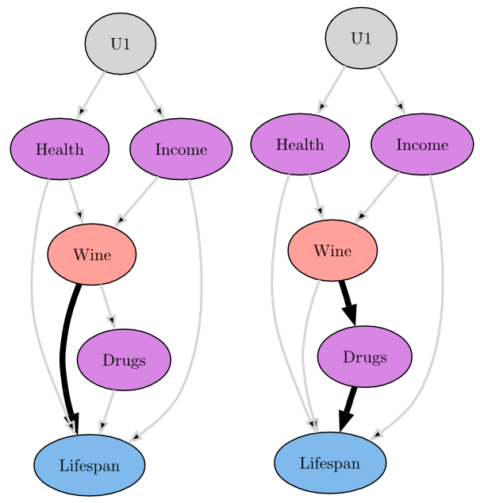

</details>

- **Back door path**: at least one arrow pointing back toward Treatment

<details>
<summary>Back Door Paths</summary>

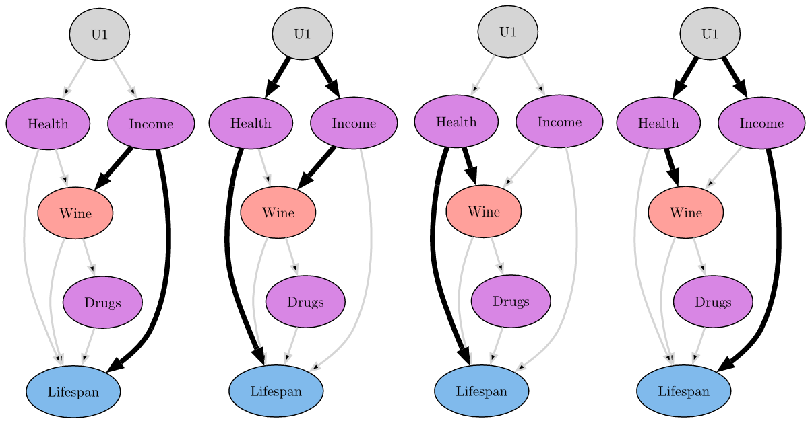

</details>

* **Good path**: describes a reason why treatment and outcome are related that *answers your research question*

<details>
<summary>Good Paths</summary>

If the research question is "Does `Wine` cause `Lifespan`?",


</details>

* **Bad path**: describes a reason why treatment and outcome are related 

  * unrelated to your research question
  * alternative explanation of the data

<details>
<summary>Bad Paths</summary>

If the research question is "*Other than how often it might affect drug-taking, does `Wine` cause `Lifespan`?",

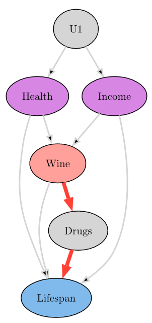

</details>

> The key to identifying the answer to our research question, then, is to find a way to dig just the Good Paths out of the data without getting distracted by the Bad ones.


## Closing paths

> A path is **Open** if all of the variables along that path have variation in the data

So we **close** a patch by

-   Picking a specific data set (e.g., no drug users)
-   Adding a variable on the path as control variable (ch 13)
-   Matching (ch 14)

> If we can control for at least one variable on each of our Bad Paths without controlling for anything on one of our Good Paths, we have identified the answer to our research question.

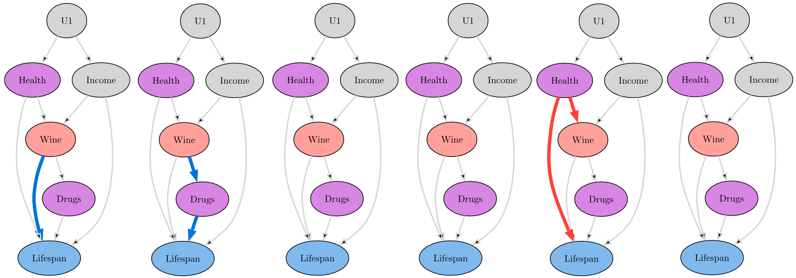

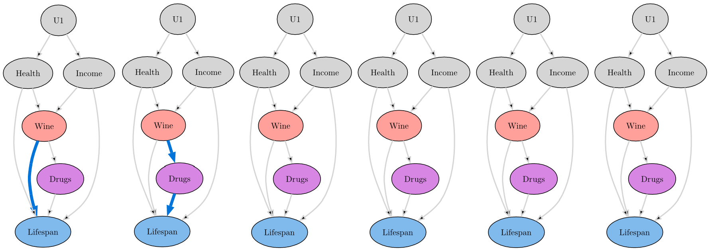


## Colliders

$$\text{Treatment} \leftarrow A \rightarrow B \leftarrow C \rightarrow \text{Outcome}$$

> A variable is a collider on a particular path if, on that path, both arrows point at it.

-   A path is closed by default if a collider sits on it
-   The path opens up if the collider is controlled for

> Because once you control for the collider, the two variables pointing to the collider become related.

We can avoid colliders by

-   Not controlling for them
-   Not choosing a sample where the collider is automatically controlled for


## Using Paths to Test the DAG

How do we check to see if our DAG is large enough?

* **Placebo test**: finding a relationship that your causal diagram says should be zero, and checking whether it's actually zero.

<details>
<summary>Placebo Test Procedure</summary>

Beyond the treatment and outcome, choose two nodes A and B

1.    List all of the paths between A and B. 
2.    Do what you need to do to make sure they’re all Closed.
3.    If A and B are still related to each other (by observational data), that means there must be some other path you didn’t account for.

</details>


## Placebo Test Example {-}

* Research Question: "Does `Wine` cause `Lifespan`?"
* Placebo Test: "Are `Drugs` and `Income` related?"

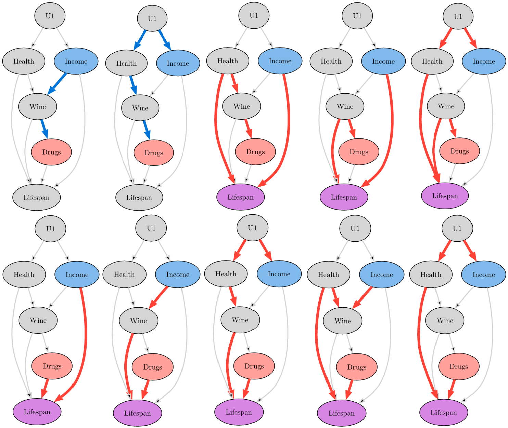

* 8/10 paths are closed because `Lifespan` is a collider

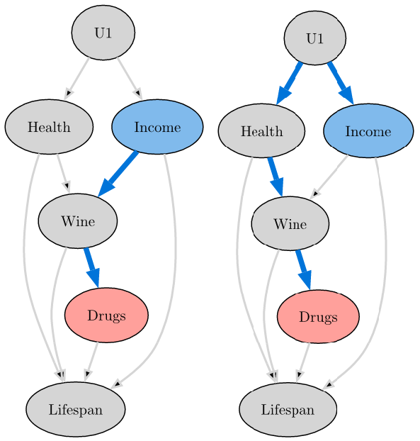

* But `Wine` seems necessary for the relationship between `Income` and `Drugs` (but `Wine` is a subset of `Drugs`)
* After controlling for `Wine`, there are no more Open paths (but the data would probably suggest a relationship)


## Interpretation of Placebo Tests {-}

- We have a model, so not accounting for all effects is okay.
- Failing a placebo test:

    -   Small but nonzero relationship: okay
    -   Enormous and super-strong relationship: remake DAG


## Meeting Videos {.unnumbered}

### Cohort 1 {.unnumbered}

`r knitr::include_url("https://www.youtube.com/embed/URL")`

<details>

<summary>Meeting chat log</summary>

```         
LOG
```

</details>
