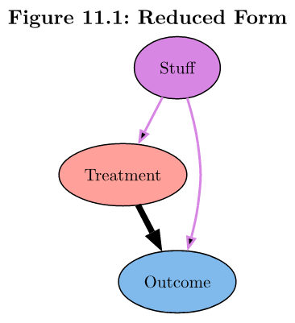

# Causality with Less Modeling

**Learning objectives:**

- Review first half of book
- Motivate second half of book


<details>
<summary>Session Info</summary>

```{r}
sessionInfo()
```

</details>


## Confidence

1. Draw a causal diagram (DAG) based on data generating process (DGP)
2. List out all paths from treatment to outcome
3. Close bad paths

But what if our causal diagram doesn't represent the data?


## Wide Open Spaces



> How can we control for Stuff without controlling for Stuff?

* Measure exogenous sources
* Close several back door paths at simultaneously
* Also controls for anything that only varies between first variable

    * Fixed effects (ch 16)

## Control Groups {-}
    
* Shouldn't be differences in back door variables
* Assumes random placement into treatment and control groups

    * Regression discontinuity (ch 20)

* Difference in Differences (ch 18)

    * Changes over time for treatment outcome
    * Changes over time for control outcome
    
    
## But Am I That Wrong?

How do we increase certainty in answering a research question?

* **Robustness test** tries to disprove an assumption

    * DiD: do changes over time differ between treatment and control?
    
* **Placebo test** is a robustness test that tries to remove a bad assumption

    * Balance table of moderators (ch 14)
    
* **Partial identification** (ch 21)

    * Relaxes assumptions
    * Range of effect (instead of point estimates)


## Meeting Videos {-}

### Cohort 1 {-}

`r knitr::include_url("https://www.youtube.com/embed/URL")`

<details>
<summary> Meeting chat log </summary>

```
LOG
```
</details>
