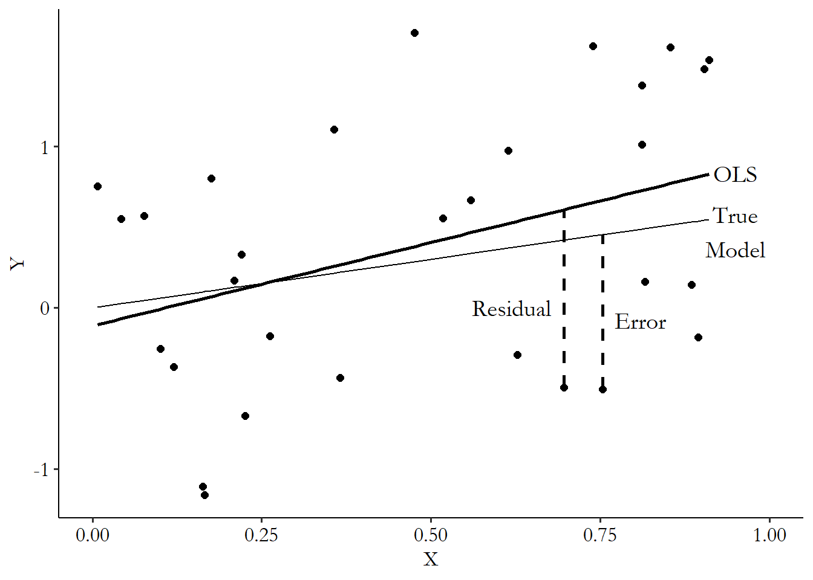
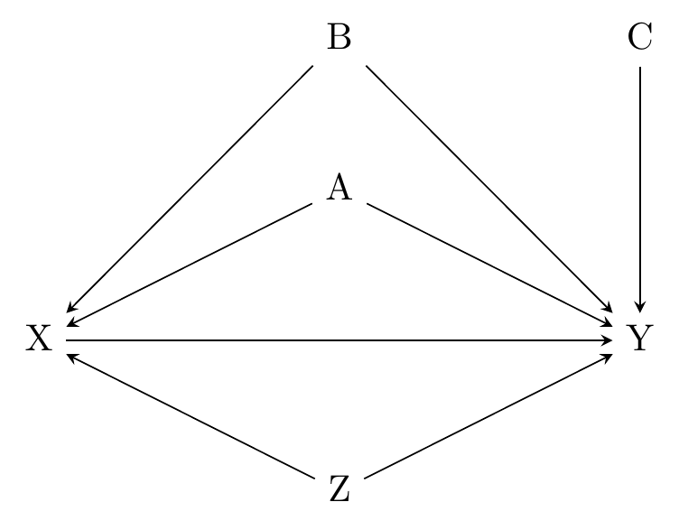
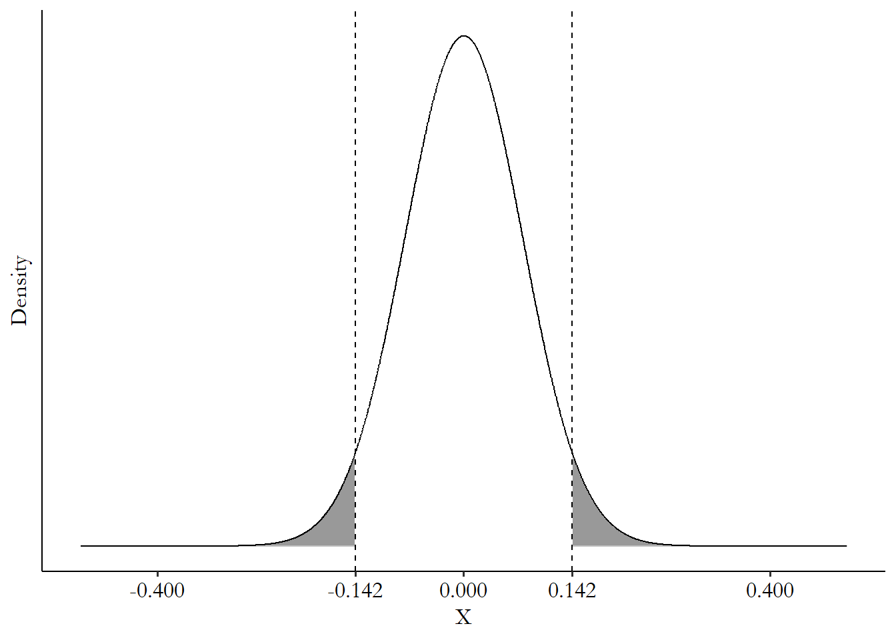
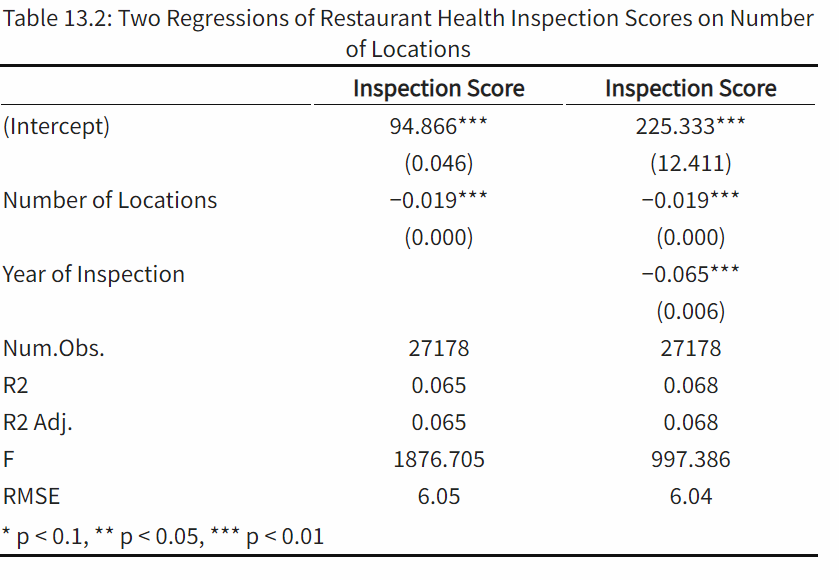
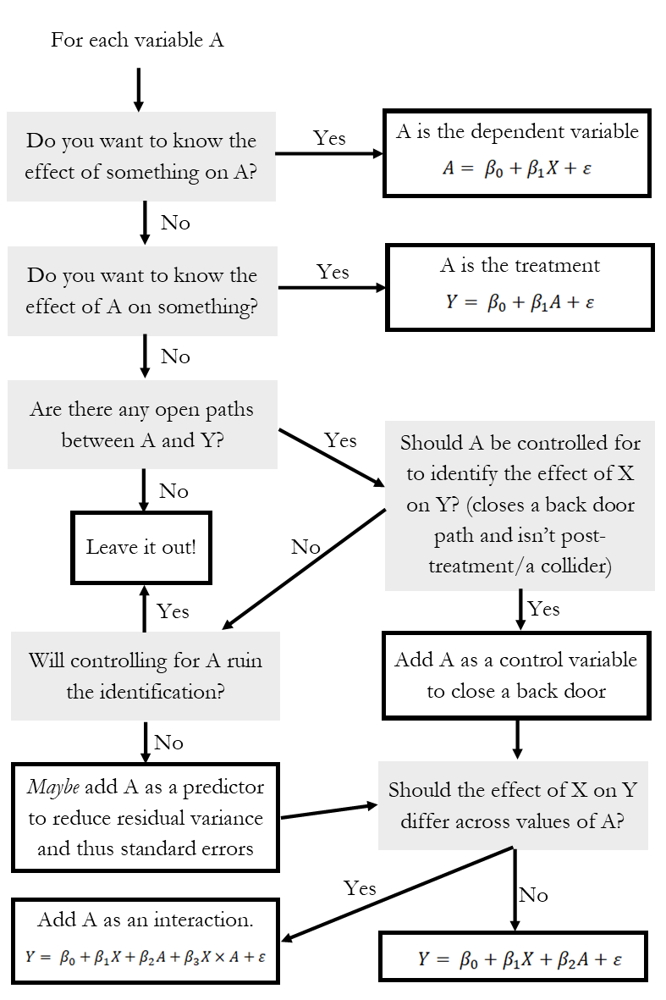
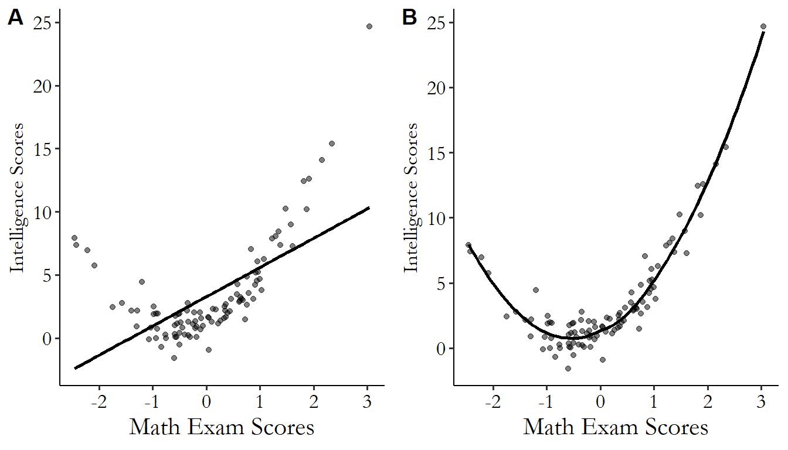
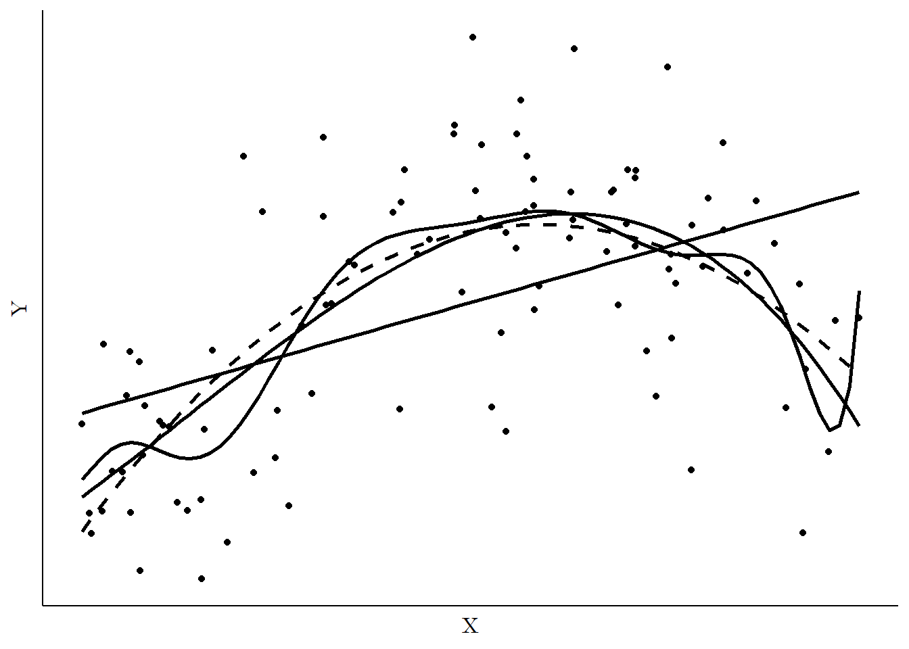
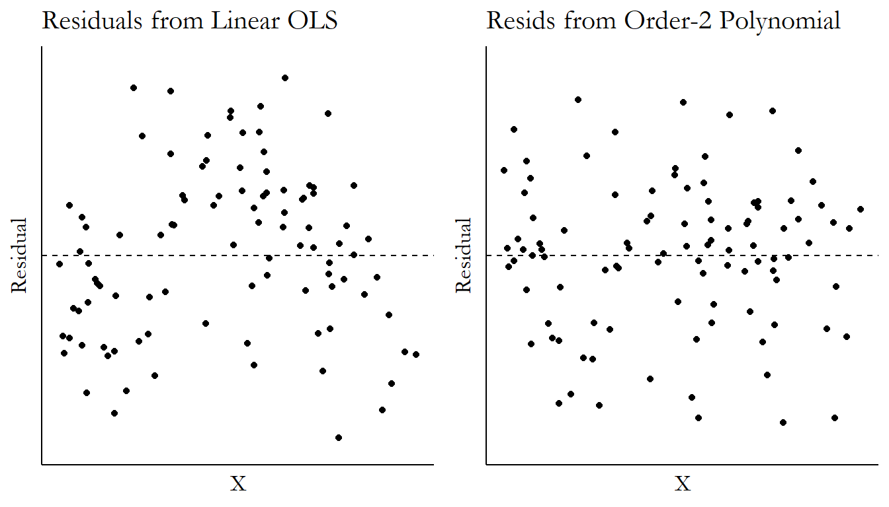
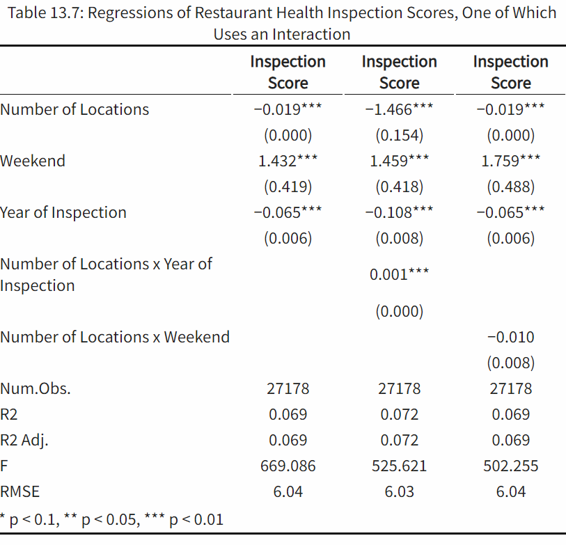
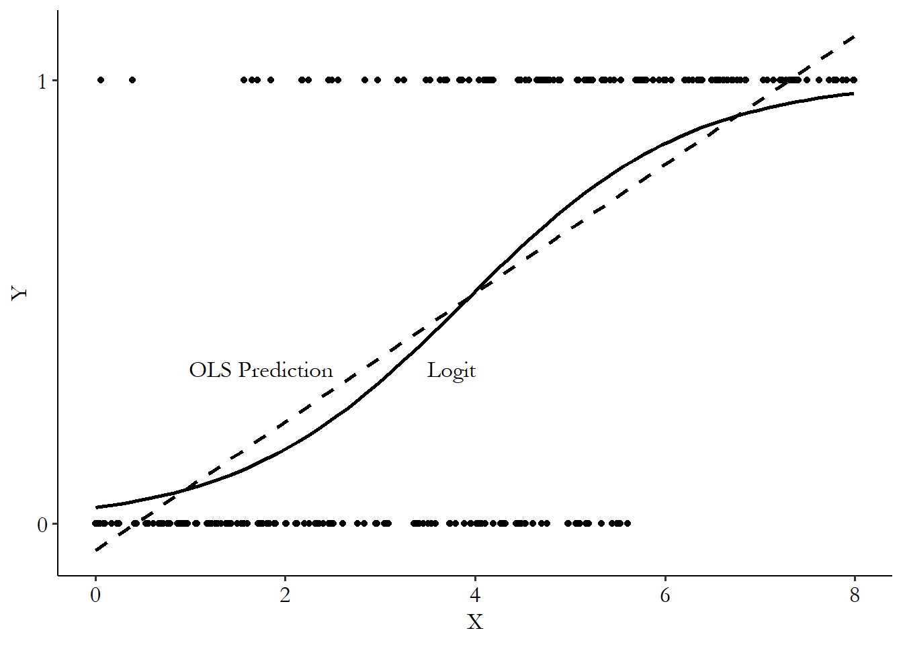

# Regression

**Learning objectives:**

-   review of basic regressions
-   how to incorporate non-continuous variables into OLS
-   how to incorporate non-linear relationships into OLS

## Basics

> Regression is the most common way in which we fit a line to explain variation.

-   also used for causal effects: closing back doors (controlling)
-   use the values of one variable ($X$) to *predict* the values of another ($Y$)
-   one way: fit a line that describes the relationship
-   interpretation of coefficient: slope
-   plugging prediction in, we get prediction: $\hat{Y}$
-   difference between $Y$ and $\hat{Y}$ is the residual
-   we can make the line curvy by adding polynomials (i.e. $\beta_1 X + \beta_2 X^2$)

## Error terms

> There's going to be a difference between the line that we fit and the observation we get.

-   **Error**: theoretical, difference between the actual outcome and prediction we'd make if we had infinite observations to estimate our prediction (true best-fit line)
-   **Residual**: observed, difference between the actual outcome and the prediction



-   error contains everything that causes Y that is not included in the model
-   if our model is $Y = \beta_0 + \beta_1 X + \epsilon$, then what's included in $epsilon$?



## Regression assumptions

**exogeneity assumption**: In a regression context, the assumption that the variables in the model (or perhaps just our treatment variable) is uncorrelated with the error term

-   basically the same conditions as for identifying a causal effect
-   if something is still in the error term and is correlated with $X$, we haven't closed this path
-   other way to say this: $X$ is correlated with $\epsilon$ and so is endogenous
-   endogeneity problem: bias --\> estimate gives the wrong answer on average
-   here: omitted variable bias

## Sampling variation

> Regression coefficients also follow a normal distribution

standard error of sampling distribution: $\sqrt{\frac{\sigma^2}{var(X) n}}$

Only three things can change:

-   shrink the standard deviation of the error term $\sigma$
-   pick an $X$ that varies a lot
-   pick a larger sample, i.e. increase $n$

## Hypothesis testing in OLS

author strongly dislikes it, since choice of rejection value is arbitrary and sharp

1.  Pick a theoretical distribution
2.  Estimate $\beta_1$ using OLS in observed data: $\hat{\beta_1}$
3.  Use that theoretical distribution to see how unlikely it would be to get $\hat{\beta_1}$
4.  If it's super unlikely, that initial value is probably wrong

Alternative: hpyothesis testing

1.  Pick null hypothesis (typically $\beta_1 = 0$)
2.  Pick rejection value $\alpha$
3.  Check probability against rejection value
4.  Possibly reject null: we think it's unlikely that the value is 0.



-   Type I error rate ("false positive rate"): rejection of something that's true

-   Type II error rate ("false negative rate"): not rejecting something that's false

-   p-value: double percentile (2-sided test)

-   t-statistic: $\frac{\hat{\beta_1}}{se(\hat{\beta_1})}$ to use with standard normal distribution

## Mantras about hypothesis testing

1.  An estimate not being statistically significant doesn't mean it's wrong.
2.  Don't change your results to get something significant.
3.  A significance test isn't the last word on a result.
4.  Significant $\neq$ meaningful

## Regression tables



-   each column represents a different regression
-   parentheses: usually standard errors (sometimes t-statistics)
-   significance stars –\> p-values (author isn't a fan)
-   below: descriptions of analysis/measures of model quality
-   adjusted $R^2$ consideres number of variables
-   $F$-statistic: null: all the coefficients in the model are all zero
-   RMSE: estimate of the standard deviation of the error term

> What can we do with all of these model-quality measures? Take a quick look, but in general don't be too concerned about these.

> If you don't care about most of the causes of your dependent variable and are pretty sure you've included the variables in your model necessary to identify your treatment, then $R^2$ is of little importance.

### Interpretation

> A one-unit change in ...

### Controls

> The idea is that by including a control for Year, we are removing the part explained by Year, and can proceed as though the remaining estimates are comparing two inspections that effectively have the same year.

## Subscripts in regression equations

$Y_i = \beta_0 + \beta_1 X_i + \epsilon_i$

-   $i$ -- what index the data varies across

## DAG to Regression



## Getting fancier

Change the variables that go into our model

-   binary/discrete
-   polynomials
-   variable transformations
-   interactions

How to determine what to keep?

-   LASSO

## Binary/discrete variables

-   always leave one out
-   interpretation: the coefficient is the difference in the dependent variable between the left-out category and this one
-   significance: joint F-test

## Polynomials



> A polynomial is when you have the same variable in an equation as itself, as well as powers of itself

$\beta_1 X + \beta_2 X^2 + \beta_3 X^2$

-   fit non-straight lines
-   must always be interpreted together (marginal effects), taking the derivative

Choosing the right number of polynomials:



-   gets harder to interpret as you add more

-   often, higher-order polynomial terms don't really do anything

-   problem of overfitting

-   almost never want to go beyond cubic

-   approach 1: check out Y \~ X plot

-   approach 2: check out residuals \~ X plot

-   approach 3: LASSO



## Variable transformation

1.  give the variable statistical properties that play more nicely with regressions (e.g. skew)

-   **but** it's fine for an outlier to affect the OLS slope

1.  linear relationship between variables

-   $Wealth = InitialWealth \times e^{10 \times InterestRate}$
-   \$ln(Wealth) = ln(InitialWealth) + 10 \times ln(InterestRate) \$

### Options

-   log (can't handle zeros)
-   $log(x+1)$
-   square root
-   asinh: $ln(x + \sqrt{x^2 + 1})$ --\> similar to log
-   winsorizing: cut off values
-   standardizing: $(X - mean(X))/ sd(X)$

### Interpretation of log

-   for values close to 0 (up to .1): basically $\beta_1 \times 100\%$

## Interaction terms

always include both terms without interaction:

> otherwise, the coefficient on $X \times Z$ accounts for not only the interaction between the two, but also the direct effect of Z itself.



-   interpretation with marginal effects (using derivative)
-   think very carefully about why you are including a given interaction term
-   trying interactions all willy-nilly tends to lead to false positives
-   be skeptical of an effect that isn't there at all for the whole sample
-   make sure you believe your story before you check the data

## Nonlinear regressions

-   not accounting for non-linearity messes up results: range, slope



-   usually tailored to dependent variable
-   binary dependent variables: usually OLS nontheless, but called *linear probability model* (LPM)
-   one way: *generalized linear model* (GLM): $Y = F(\beta_0 + \beta_1X)$, where $F$ is the link function and the inside the index.

### good link functions

-   take any value from $-\infty$ to $\infty$
-   output values between 0 and 1
-   input increases --\> output increases
-   popular functions: logit, probit

### Interpretation

-   use marginal effects
-   $\frac{\partial Pr(Y = 1)}{\partial X} = \beta_1 Pr(Y = 1) (1- Pr(Y = 1))$
-   but this changes with every $X$
-   recommendation against marginal effect at the mean
-   instead: average marginal effect

## Standard errors

-   Standard errors can be messed up in may ways because assumptions are violated
-   We can account for this, though
-   correlated errors change the sampling distribution: mean is swingier, larger standard deviation

### Assumptions

1.  error term $\epsilon$ is normally distributed --\> OLS is mostly okay with this
2.  error term is independent and identically distributed (iid)

-   autocorrelation: temporal/spatial
-   heteroskedasticity
-   we have to figure out how this assumption fails

### Fixes (mostly sandwich estimators)

-   heteroskedasticity: Huber-White
-   auto-correlation: HAC, e.g. Newey-West
-   geographic correlation: Conley spatial standard errors
-   hierarchical structure: clustered standard errors, e.g. Liang-Zenger
-   right level of clustering: treatment level/domain knowledge
-   only works for large number of clusters, \$ \>50\$; fix: wild cluster bootstrap standard errors
-   bootstrapped standard errors

### Bootstrapping

1.  start with data set with $N$ observations
2.  randomly sample $N$ observations (with replacement)
3.  estimate statistic
4.  repeat many times (a couple of 1,000)
5.  look at distribution of estimates

-   can be used for any statistic
-   need large samples
-   don't perform well with extreme value distributions
-   doesn't do well with autocorrelation

## Sample Weights

-   weights are used to correct for sampling bias
-   procedure: weighted least squares

**Surveys** 

- weights often provided 
- weight by inverse of probability to be included

**Aggregated data** 

- some groups are larger than others 
- variation differs with that 
- frequency weighting vs. inverse variance weighting: estimate same, standard errors differ 
- frequency weighting 
- if exactly the same observation, just repeated 
- "a collection of independent, completely identical observations" 
- procedure: just replicate each observation weight-times - inverse variance weighting 
- aggregated data 
- each aggregate observation is weighted by number of observations 
- other application: meta-analysis

## Collinearity

> A tempting thought when you have multiple measures of the same concept is that including them all in the model will in some way let them complement each other, or add up to an effect. But in reality it just forces each of them to show the effect of the variation that each measure has that’s unrelated to the other measures.

-   happens e.g. when including variables measuring the same latent variable
-   super highly correlated variables drive standard errors upwards

**Addressing this**

-   dimension reduction: e.g. latent factor analysis, PCA
-   variance inflation factor
-   $VIF_j = \frac{1}{1-R^2_j}$
-   exclude variable if $VIF > 10$

## Measurement error

-   often happens when using proxies
-   other possibility: actual measurement error
-   $X = X^* + \epsilon$

**Classical measurement error**

-   error term is unrelated to latent variable
-   leads to attenuation ($\hat{\beta_1}$ closer to 0 than true $\beta_1$)
-   just treat estimate as lower bound
-   if measurement error in $Y$: no problem, just more stuff in error term

**Non-classical measurement error**

-   error term is related to latent variable
-   e.g. self-reported exercising
-   real issue!
-   addressing this
-   Deming regression / Total Least Squares
-   GMM
-   instrumental variables: use one measurement as instrument for other measurement

## Penalized regression

-   dropping some controls
-   $argmin_\beta \{\sum(Y - \hat{Y})^2 + \lambda F(\beta)\}$
-   minmize sum of squared residuals AND make $\beta$ function small
-   implementation: LASSO, ridge regression, elastic net regression (LASSO + ridge)
-   throw out variables that LASSO thinks are unimportant
-   watch out: standardize all variables
-   choose $\lambda$ as you want; higher value --\> toss out more variables

## Meeting Videos {.unnumbered}

### Cohort 1 {.unnumbered}

`r knitr::include_url("https://www.youtube.com/embed/URL")`

<details>

<summary>Meeting chat log</summary>

```         
LOG
```

</details>
