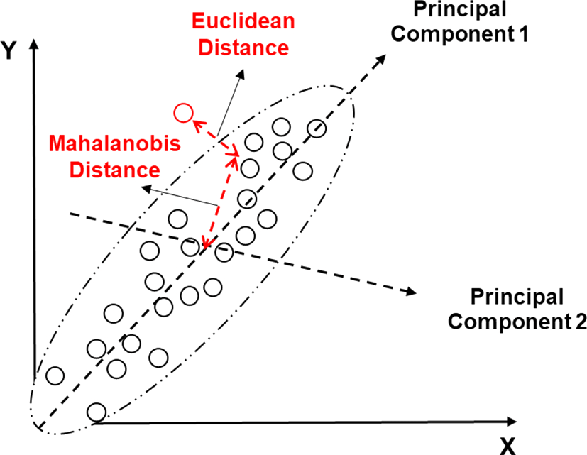

# Matching

**Learning objectives:**

- Elaborate on closing back doors
- Discuss distance formulas
- Revisit treatment effects

<details>
<summary>Session Info</summary>

```{r}
sessionInfo()
```

</details>


## Another Way to Close Back Doors

* Previously: regression models

  * Close backdoor path with $W$ by choosing a sample where
  
  $$\text{var}(W) = 0$$
  
> **Matching** is the process of closing back doors between a treatment and an outcome by *constructing groups that are similar according to a set of matching variables*.

## Weighted Averages

> Matching methods create a set of *weights* for each observation ... designed to make the treatment and control groups comparable.

$$\frac{ \sum w Y  }{ \sum w }$$


## Matching in Concept

<details>
<summary>What will our matching criteria be?</summary>

We want to minimize the *distance* between the treatment observations and the control observations.

</details>

<details>
<summary>Are we selecting matches or constructing a matched weighted sample?</summary>

* Distance matching
* Propensity matching
* Kernel matching

</details>

<details>
<summary>If we’re selecting matches, how many?</summary>

* One-to-one matching
* $k$ nearest neighbors

</details>

<details>
<summary>If we’re constructing a matched weighted sample, how will weights decay with distance?</summary>

* Epanechnikov kernel

$$K(x) = \frac{3}{4}(1-x^{2}), \quad -1 \leq x \leq 1$$


* Inverse weighting

</details>

<details>
<summary>What is the worst acceptable match?</summary>

* Caliper or bandwidth
* Fewer, but better matches $\rightarrow$ less bias, less precision
* More, but worse matches $\rightarrow$ more bias, more precision

</details>


## Multiple Matching Variables

<details>
<summary>Distance Matching</summary>

$$d_{M}(\vec{x}, \vec{y}; Q) = \sqrt{(\vec{x} - \vec{y})^{T}\Sigma^{-1}(\vec{x} - \vec{y})}$$



* Image [source](https://www.researchgate.net/figure/Mahalanobis-distance-T-and-Euclidean-distance-Q_fig2_336760197): Lee, et al (2020)
* Curse of Dimensionality

</details>

<details>
<summary>Entropy Balancing</summary>

**Entropy balancing** enforces restrictions on moments

* means, variances, skewness, etc.

* Hainmueller, Jens. 2012. “[Entropy Balancing for Causal Effects: A Multivariate Reweighting Method to Produce Balanced Samples in Observational Studies.](https://www.mit.edu/~jhainm/Paper/eb.pdf)” *Political Analysis* 20 (2): 25-46.

Choose weights $w_{i}$ such that

$$\text{min} \sum_{\{i|D = 0\}} h(w_{i})$$

* balance constraint: $\sum_{\{i|D = 0\}} w_{i}c_{ri}(X_{i}) = m_{r}$
* normalization: $\sum_{\{i|D = 0\}} w_{i} = 1$


</details>


## Propensity Score Weighting

**Propensity score** is the estimated probability that a given observation would have gotten treated.

* Used for inverse probability weighting
* Usually estimated by regression

Curse of dimensionality?

* Penalized regression (e.g. ridge, LASSO)
* Boosted regression: poor estimates given higher weights


## Assumptions for Matching

<details>
<summary>Conditional Independence</summary>

> The set of matching variables you've chosen is enough to close all back doors.

</details>

<details>
<summary>Common Support</summary>

* Matching assumes that there exist appropriate control observations to match.

> Look at the distribution of a variable for the treated group against the distribution of that same variable for the untreated group

</details>

<details>
<summary>Balance</summary>

**Balance Table**

* Shows differences

  * between treated and control groups
  * for means, deviations, etc.
  * for several variables
  
* Create table columns

  * unmatched data
  * matched data

</details>


## Estimation with Matched Data

> **Doubly robust estimation**. An estimation method that identifies the effect even if one of the regression or matching models is misspecified. 

1. Estimate propensity score $p$ for each observation
2. Compute inverse probability weights

  a. Treated observations: $\frac{1}{p}$
  b. Untreated observations: $\frac{1}{1-p}$
  
3. Make regression model on treated observations
4. Make regression model on untreated observations
5. Store predictions for each model
6. Compare means
7. Standard errors?  Use bootstrap standard errors


## Matching and Treatment Effects

* ATT: match control observations to treated observations
* ATUT: match treated observations to control observations

$$ATE = x \times ATT + (1-x) \times ATUT$$

where $x$ is the proportion of treated observations


## Meeting Videos {-}

### Cohort 1 {-}

`r knitr::include_url("https://www.youtube.com/embed/URL")`

<details>
<summary> Meeting chat log </summary>

```
LOG
```
</details>
