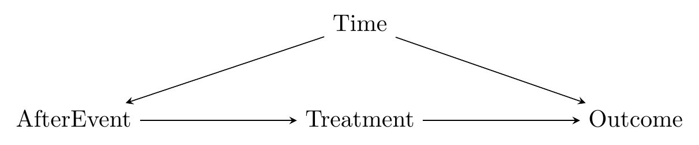
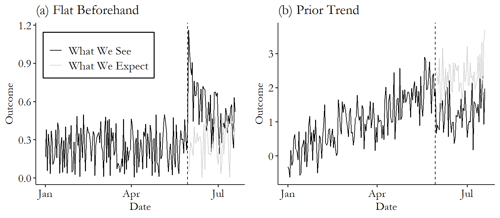
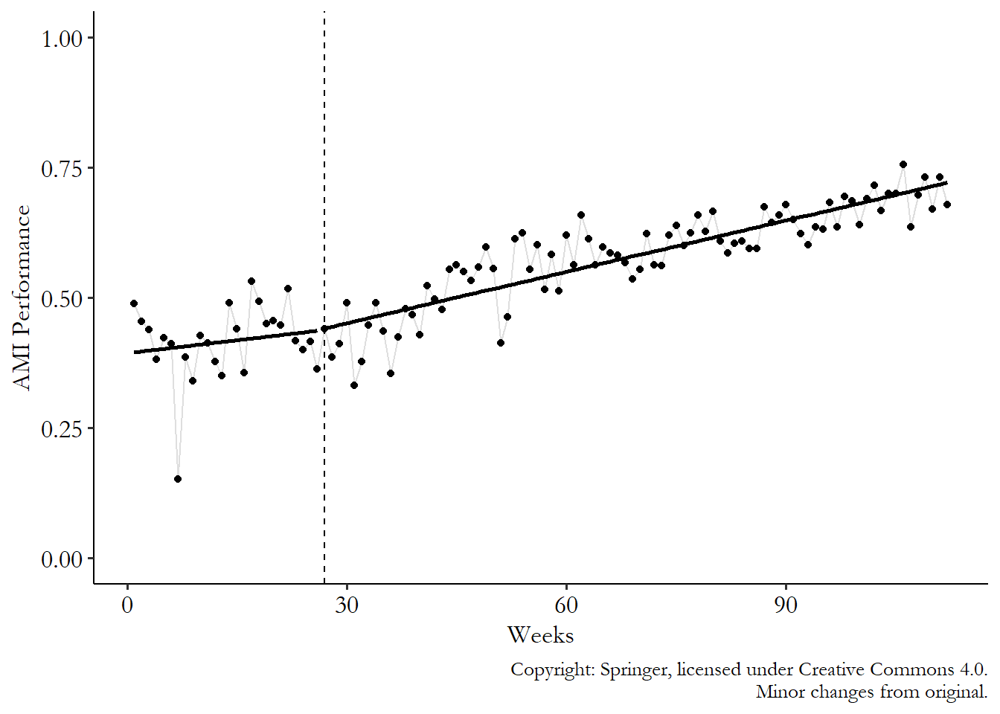
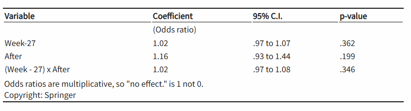
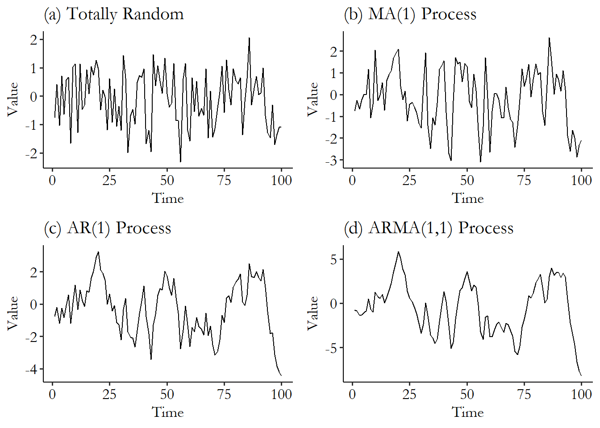

# Event Studies

**Learning objectives:**

-   THESE ARE NICE TO HAVE BUT NOT ABSOLUTELY NECESSARY

## How does it work?

> Whatever changed from before the event to after is the effect of that treatment.

> Many superstitions are poorly done event studies

-   only use within variation
-   only consider treatments that switch from `off` to `on`
-   instead of panel data: time series data



-   back door: *Treatment \<- AfterEvent \<- Time -\> Outcome*
-   control for some elements of *Time*

## Prediction and Deviation

-   Treatment should be the only thing that's changing
-   We thus need a counterfactual, e.g. before-treatment trend
-   best to have short time window (short horizon)



**Dealing with this trend**

1.  Ignore it: compare before/after
    -   reasonable to believe that there's no time effect
    -   if data looks flat
    -   extremely tiny time span
2.  Predict after-event data using before-event data
    -   extrapolate from trend
3.  Predict after-event data using after-event data
    -   relationships between outcome and other variables in before-event period

## Terminology

-   health: statistical process control
-   interrupted time series
    -   time series econometrics
    -   fitting two lines before/after event
-   variants controlling for time with control group
-   economics: means something different – multiple treated groups, treated at different times (Ch. 18)

## How it's used in Finance

-   stock prices reflect information about a company
-   short time window

1.  *estimation period* before event, *observation period* from just before the event to the period of interest after event
2.  use *estimation period* data to predict $\hat{R}$ (predicted stock returns)
    -   means-adjusted returns model
    -   market-adjusted returns model
    -   risk-adjusted returns model
3.  In *observation period*: $AR = R - \hat{R}$ to get abnormal return
4.  consider *AR* in observation period

**Example**

-   estimation period: May--July
-   observation period: August 6 -- August 24

```{r}
library(tidyverse); library(lubridate)
goog <- causaldata::google_stock

event <- ymd("2015-08-10")

# Create estimation data set
est_data <- goog %>%
 filter(Date >= ymd('2015-05-01') &
 Date <= ymd('2015-07-31'))

# And observation data
obs_data <- goog %>%
 filter(Date >= event - days(4) & 
 Date <= event + days(14))

# Estimate a model predicting stock price with market return
m <- lm(Google_Return ~ SP500_Return, data = est_data)

# Get AR
obs_data <- obs_data %>%
 # Using mean of estimation return
 mutate(AR_mean = Google_Return - mean(est_data$Google_Return),
 # Then comparing to market return
 AR_market = Google_Return - SP500_Return,
 # Then using model fit with estimation data
 risk_predict = predict(m, newdata = obs_data),
 AR_risk = Google_Return - risk_predict)

# Graph the results
ggplot(obs_data, aes(x = Date, y = AR_risk)) + 
 geom_line() + 
 geom_vline(aes(xintercept = event), linetype = 'dashed') + 
 geom_hline(aes(yintercept = 0))
```

## How it's used with regressions

-   estimate one regression of the outcome on the time period before the event
-   estimate outcome on the time period after the event
-   check difference
-   doesn't have to be linear

$$
Outcome = \beta_0 + \beta_1 t + \beta_2 After + \beta_3 t \times After + \epsilon
$$

-   more precise estimate of time trend than going day by day
-   but limited by shape
-   but need to be careful about significance testing (autocorrelation)
-   use HAC standard errors

### Example: Improved ambulance care

-   heart attack performance $(AMI) \sim  Week - 27$

$$
AMI = \beta_0 + \beta_1 (Week - 27) + \beta_2 After + \beta_3 (Week-27) \times After + \epsilon
$$





## How it's used when taking time series seriously

-   some events impact all groups
    1.  summarize groups into one (but losing information)
    2.  treat each group separately, and use separate regressions
    3.  aggregate with regression, $\beta_i$ being a group FE

$$
Outcome = \beta_i + \beta_1t + \beta_2 After + \beta_3 t \times After + \epsilon
$$

-   event matters differently over time
    -   leave out time just before the event kicks in
    -   standard errors for each period
    -   everything is relative to the period before the event

$$
Outcome = \beta_0 + \beta_t + \epsilon
$$

```{r}
library(tidyverse); library(fixest)
set.seed(10)

# Create data with 10 groups and 10 time periods
df <- crossing(id = 1:10, t = 1:10) %>%
 # Add an event in period 6 with a one-period positive effect
 mutate(Y = rnorm(n()) + 1*(t == 6))

# Use i() in feols to include time dummies,
# specifying that we want to drop t = 5 as the reference
m <- feols(Y ~ i(t, ref = 5), data = df,
 cluster = 'id')

# Plot the results, except for the intercep,# and add a line joining 
# them and a space and line for the reference group
coefplot(m, drop = '(Intercept)',
 pt.join = TRUE, ref = c('t:5' = 6), ref.line = TRUE)
```

-   significant where we expect it ($t = 6$)
-   unexpectedly significant ($t = 2$ and $t = 4$) b/c small sample

## Forecasting with Time Series Models

-   time series forecasting was made to predict beyond a point of time
-   huge field, focusing on ARMA here
-   AR: autoregression, MA: moveing average
-   AR(1): $Y_t = \beta_0 + \beta_1 Y_{t-1} + \epsilon$
-   MA(1): $Y_t = \beta_0 + (\epsilon_t + \theta\epsilon_{t-1})$
-   ARMA(2,1): $Y_t = \beta_0 + \beta_1 Y_{t-1} + \beta_1 Y_{t-2}  + (\epsilon_t + \theta\epsilon_{t-1})$

 {.unnumbered}

-   many extensions
-   `R` package: `fable`

## Joint tests

-   event study combines event-study effect & model for counterfactual
-   significance tests test both!
-   partial answer: placebo tests
    -   test something where we know there's no effect
    -   if we find something, the counterfactual model is wrong

## Meeting Videos {.unnumbered}

### Cohort 1 {.unnumbered}

`r knitr::include_url("https://www.youtube.com/embed/URL")`

<details>

<summary>Meeting chat log</summary>

```         
LOG
```

</details>
