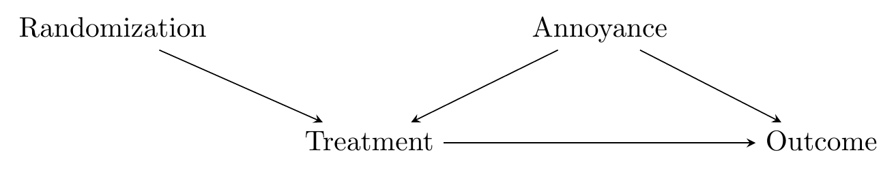
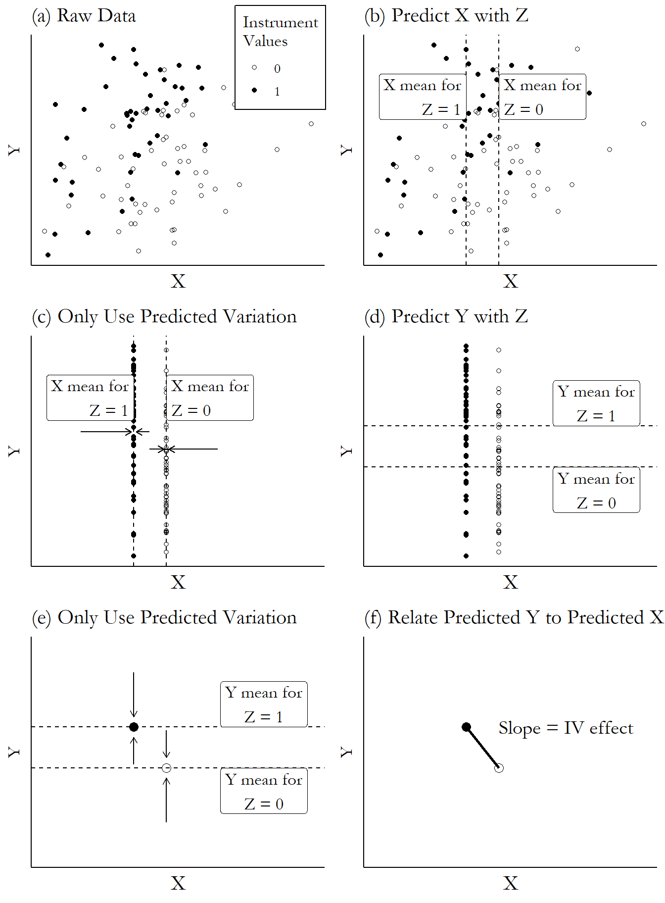
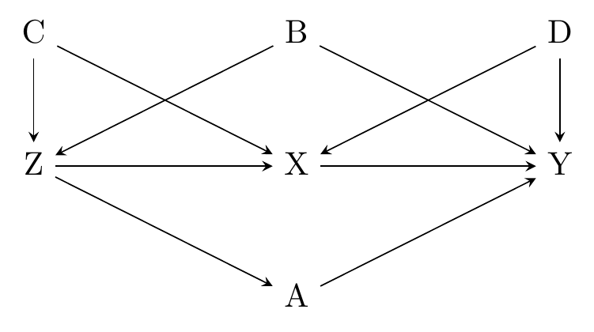
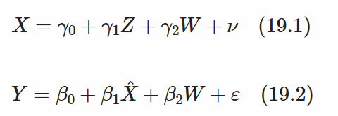

# Instrumental Variables

```{r setup, include=FALSE}  
knitr::opts_chunk$set(warning = FALSE, message = FALSE)  
```


## How does it work?

-   source of variation that allows you to isolate just the *front-door path*
-   similar to an RCT
    -   there: randomized assignment to treatment
    -   here: source of randomization without backdoors
-   moves the requirement from closing back doors *Treatment –\> Outcome* to *Randomization –\> Outcome* (and front doors that don't go through *Treatment*)
-   Opposite of controlling: only variation coming from instrument



-   Isolate part of treatment driven by instrument
    1.  Use instrument to explain treatment
    2.  Remove any treatment parts that are not explained by instrument
    3.  Use instrument to explain outcome
    4.  Remove any part of the outcome that is not explained by instrument
    5.  Look at relationship b/w remaining outcome and remaining treatment



## Assumptions

1.  instrument is *relevant*
2.  instrument is *valid*

**Relevance**

-   *Z* needs to explain *X*
-   if correlation is small: *weak instrument*
    -   estimate likely to jump around from sample to sample
    -   if small, variation matters
-   We can actually check for relevance: look at relationship b/w *X* and *Z*

**Validity**

-   Instrument has no back doors

-   Any paths b/w *Z* and *Y* need to pass through instrument, or be closed

-   here: need to close *Z –\> B –\> Y* and *Z –\>A –\> Y*

-   validity very hard to argue, e.g. with rain: correlated to many things

-   choosing good instruments:

    -   as-good-as-random: truly comes from outside the system, applied almost completely randomly (real randomization / Mendelian randomization)

    -   you wouldn't ever think to include it in your regression

    -   randomness is more believable (e.g. RCT with imperfect compliance, RDD)



**Monotonicity**

-   no defiers (see [IV and treatment effects])

## Canonical designs

clever designs, but context-dependent

-   judge designs –\> harshness of judgments
-   military drafts –\> being in the army
-   compulsory schooling –\> years of schooling
-   Bartik shift-share IV (combine economy-wide trends with distribution of industry)
-   locations of original immigration wave –\> location of later immigrants
-   twin births –\> number of children
-   direction of wind –\> pollution

## Instrumental Variables estimator

**Two-stage least squares (2SLS)**

-   1st stage: instrument to predict treatment
-   2nd stage: predicted treatment to predict outcome
-   include controls in both stages
-   ratio of effects: $\frac{Z -> Y}{Z -> X}$



-   pros
    -   easy to estimate
    -   flexible (add instruments possible)
    -   easy to understand (OLS)
-   cons
    -   doesn't perform well with small samples
    -   doesn't do well with heteroskedastic errors

**Generalized Method of Moments (GMM)**

-   based on assumptions + theory: construct statistical moments
-   IV: assume *Z* is unrelated to second-stage error term
-   overidentification: \# instruments \> \# treatment/endogenous variables
    -   GMM more precise than 2SLS (with heteroskedasticity)

## Example: Insurance takeup

-   rural China
-   households randomly informed about insurance
    -   default 1: only information
    -   default 2: information & buy insurance

> How much does your friends buying insurance affect your own takeup of insurance?

-   adding FE
    -   easy with `fixest`
    -   more difficult with `gmm` --\> add as factor

### 2SLS

```{r twosls, warning=FALSE}
# There are many ways to run 2SLS; 
# the most common is ivreg from the AER package. 
# But we'll use feols from fixest for speed and ease 
# of fixed-effects additions later
library(tidyverse); library(modelsummary); library(fixest)
d <- causaldata::social_insure

# Include just the outcome and controls first, then endogenous ~ instrument 
# in the second part, and for this study we cluster on address
m <- feols(takeup_survey ~ male + age + agpop + ricearea_2010 +
            literacy + intensive + risk_averse + disaster_prob +
            factor(village) | pre_takeup_rate ~ default, 
            cluster = ~address, data = d)

# Show the first and second stage, omitting all
# the controls for ease of visibility
msummary(list('First Stage' = m$iv_first_stage[[1]],
                'Second Stage' = m),
                coef_map = c(default = 'First Round Default',
                fit_pre_takeup_rate = 'Friends Purchase Behavior'),         
                stars = c('*' = .1, '**' = .05, '***' = .01))
```

### GMM

```{r gmm, warning=FALSE}
library(modelsummary); library(gmm)
d <- causaldata::social_insure
# Remove all missing observations ourselves
d <- d %>%
    select(takeup_survey, male, age, agpop, ricearea_2010,
           literacy, intensive, risk_averse, disaster_prob,
           village, address, pre_takeup_rate, default) %>%
    na.omit()

m <- gmm(takeup_survey ~ male + age + agpop + ricearea_2010 +
         literacy + intensive + risk_averse + disaster_prob +
         factor(village) + pre_takeup_rate,
         ~ male + age + agpop + ricearea_2010 +
         literacy + intensive + risk_averse + disaster_prob +
         factor(village) + default, data = d)

# We can apply the address clustering most easily in msummary
msummary(m, 
         vcov =  ~address, 
         stars = c('*' = .1, '**' = .05, '***' = .01),
         coef_map = "pre_takeup_rate")
```

## IV and treatment effects

-   2SLS will give different results depending on which IV is used
-   people who are more affected get higher weights

terminology

-   **compliers:** effect is in the expected direction (positive weight)

-   **always-takers/never-takers**: completely unaffected by instrument (zero weight)

-   **defiers**: effect is in the opposite direction of the expected (negative weight)

-   if all compliers affected the same way: 2SLS gives average treatment effect among compliers

-   we need to assume that there are no defiers (negative weight): *monotonicity assumption*

## Checking IV assumptions

**Relevance**

-   and Z are strongly enough related to each other that Z is not a weak instrument
-   first-stage *F-statistic* test (comes with `fixest`)
    1.  estimate 1st stage
    2.  do a joint F test on instruments
    3.  get F statistic from joint F test
-   no real cut-off; the bigger, the less bias (b/c of random correlation between Z and error term)
-   if weak: use alternative approach (like Anderson-Rubin confidence intervals)

**Validity**

-   test for open back doors between *Z* and *Y,* or *second-stage error term*

    -   if they're related, validity is violated

    -   but: if we have a bias, the residual isn't going to represent the error term very well

-   instead: second stage and include instrument as control

    -   if coefficient for instrument =/= 0: violation of validity

    -   shows there's another pathway than through X

-   Durbin-Wu-Hausman test

    -   compare OLS to IV: if different, X does have open back doors

    -   compare 2 IVs (overidentification): if different, additional instruments likely invalid

-   Overidentification

    -   Sargan test (2SLS)

    -   Hansen test (GMM)

    -   combining two instruments –\> different LATE, but doesn't mean that instruments are invalid; just don't produce same results

Failing to find evidence of violation doesn't mean it's not violated.

## How the Pros do it

Tips on how to go further

## Don't just test for weakness, fix it

-   use method that's not as strongly affected by weak instruments
-   most common: 1 treatment, 1 control variable**

**Adjust standard errors**

-   old (1949): Anderson-Rubin confidence intervals
-   not universal practice, but you could always report these SE
-   in `R`: `AER::ivreg`, then `ivpack::anderson.rubin.ci`

Limited-information maximum likelihood (LIML)

-   estimation that performs better with weak instruments
-   scales down prediction with parameter $\kappa$
    -   $\kappa = 1$ --> no adjustment, 2SLS
    -   $\kappa < 1$ --> bring back some of the endogenous variable
-   additionally use Fuller's $\alpha$
    -   $\kappa = \hat{\kappa} - \frac{\alpha}{N - N_1}$
    -   $N$ # observations, $N_1$ # instruments
    -   worse precision, but less reliance on instrument
    
**Use lots of weak instruments**

-   starting place: Chao and Swanson (2005)

## Way past LATE

-   A local average treatment effect is what 2SLS gives us by default

**IV with different values**

-   Heckman and Vytlacil (1999)
-   you can identify a bunch of effects by comparing different values
-   what’s the treatment effect among those pushed from the very lowest value of the instrument to just above that?
-   assumption: probability of treatment is zero for some values of the instrument, and one for others
-   average whole distribution

**Correlated random effects and 2SLS**

-    treatment interacts with some individual variation we can’t observe
-   Correlated random effects try to model unobserved individual variation
-   treatment $\times$ control variables, then estimate model with correlated random effects
-   give average treatment effect
-   this method tends to work better the more continuous the treatment variable is
-   Woolridge (2008)

## Nonlinear IV

-   assumption so far: linear model
-   cannot do a double-logit: forbidden regression (Woolridge, 2010)
-   one possibility: linear probability model (OLS)
    -   but: poor performance of OLS vs. probit/logit when the mean of the binary variable is near 0 or 1
    -   estimates that are less precise than models that properly take into account nonlinearity
    
**Binary treatment**

Woolridge (2010)

1.    estimate 1st stage with nonlinear regression (probit):  treatment on instruments and controls
1.    get the predicted values
1.    use  predicted values in place of instrument in 2SLS

treatment effect regression

-   avoids 2SLS
-   directly models the binary data structure
-   estimate the probit first stage and linear second stage at the same time
-   `sampleSelection::treatReg`

**Binary Outcome: Control function approach**

-   don't isolate the explained part of $X$ 
 and use that in the 2nd stage
-   instead: use $X$, but also control for the unexplained part of it
-   linear IV: same results as 2SLS
-   `ivprobit`

**Both are binary: Bivariate probit **

-   2SLS can be especially imprecise when both stages are binary
-   ML estimate: two probit models at the same time
-   dependent variables of the models are correlated
-   `GJRM::gjrm(Model = "B", margins = c('probit','probit'))`

## Validity violation

-   a little is okay
-   can still get useful inferences out of the analysis
-   2 approaches
    -   mostly-valid instrument
    -   make up for invalidity by using many instruments


**Mostly-valid instrument**

-   partial identification
    -   Conley, Hansen, and Rossi (2012)
    -   think about how bad that validity violation is
    -   range of plausible estimates based on plausible range of violations
-   replace validity assumption
    -   Nevo and Rosen (2012): correlation between instrument and 2nd-stage error term is the same sign as the correlation between the treatment variable and the error term, but is smaller
    -   Flores and Flores-Lagunes (2013): monotonicity
    
**Many instruments**

-   instrument has many subcomponents that can each be measured separately and treated as own instrument
-   Chernozhukov, Hansen, and Spindler (2015): use LASSO to select most important predictors (controls & instruments)
-   Windmeijer et al. (2019)
    -   put in all instruments, including invalid ones, in 2nd stage
    -   only valid ones have no predictive power
-   Kolesár et al. (2015)
    -   just use all instruments
    -   if not too many are invalid: works


## Meeting Videos {.unnumbered}

### Cohort 1 {.unnumbered}

`r knitr::include_url("https://www.youtube.com/embed/URL")`

<details>

<summary>Meeting chat log</summary>

```         
LOG
```

</details>
